```mermaid
graph LR
    A[💻 Your Code] -->|HTTP Request| B[☁️ OpenAI API]
    B -->|Process with GPT| C[🤖 LLM]
    C -->|Generate Response| B
    B -->|HTTP Response| D[📄 Text/JSON Output]
    D --> A

    style A fill:#e8f5e9
    style B fill:#e1f5ff
    style C fill:#fff9c4
    style D fill:#c8e6c9
```

```mermaid
sequenceDiagram
    participant U as 👤 User
    participant C as 💻 Your Code
    participant API as ☁️ OpenAI API

    Note over C: Initialize with instructions
    C->>API: instructions="You are a helpful tutor"

    U->>C: "Explain async/await"
    C->>API: input="Explain async/await"
    API->>C: response.output_text
    C->>U: "Async/await allows..."

    U->>C: "Give me an example"
    C->>API: [previous context + "Give me an example"]
    API->>C: response.output_text
    C->>U: "Here's an example: async def..."
```

# Lesson 01: Your First OpenAI API Call

## What You'll Learn

In this lesson, you'll make your first API call to OpenAI and understand the fundamental building blocks of every AI application.

Almost everything you build as an AI engineer involves making API calls to Large Language Models. Understanding how to call these APIs directly—before using frameworks—is essential.

By the end of this lesson, you'll be able to send prompts to GPT models, understand how messages work, control response behavior with parameters, and track costs with token counting. You'll also know how to stream responses for better user experience and handle errors gracefully.

This foundation is critical. Every advanced pattern you'll learn—from RAG systems to autonomous agents—builds on these basics.

## The Problem

AI models are powerful, but they're useless if you can't communicate with them. You need to know how to send instructions, control behavior, and get reliable responses.

Most developers jump straight into frameworks that hide these fundamentals. When things break or don't work as expected, they're stuck. Understanding the OpenAI API directly gives you the control and confidence to build production systems.

## How the OpenAI API Works

The OpenAI API gives you programmatic access to GPT models via HTTP endpoints. The concept is simple: you send structured inputs like prompts and context, and you get structured outputs like text or JSON.



The **Responses API** is OpenAI's recommended way to interact with GPT models. Released in March 2025, it's an evolution of Chat Completions that brings added simplicity and powerful agentic primitives. It can manage conversation state server-side, supports built-in tools like web search, and provides better performance through improved caching.

### Message Types

Every API call includes messages with specific roles:

- **system**: Sets the behavior and context for the assistant (e.g., "You are a helpful Python tutor")
- **user**: The user's input or question
- **assistant**: Previous responses from the AI (used for conversation history)

Think of the system message as programming the AI's personality and expertise. The user message is the actual query. Assistant messages maintain conversation context.



### Key Parameters You Need to Know

- **model**: Which GPT model to use (`gpt-4o-mini`, `gpt-4`, etc.)
- **temperature**: Controls randomness (0 = deterministic, 1 = creative)
- **max_tokens**: Maximum length of the response
- **stream**: Whether to stream responses token-by-token

### Temperature: Your Most Important Parameter

Temperature controls how random or creative the model's responses are:

- **0**: Deterministic, factual tasks (code generation, data extraction, classification)
- **0.3-0.5**: Balanced responses (most business use cases)
- **0.7-1.0**: Creative tasks (brainstorming, storytelling, marketing copy)

For production systems, default to temperature=0 unless you specifically need creativity.

## Setting Up Your Environment

Get your API key from [platform.openai.com](https://platform.openai.com). Create a `.env` file in the repository root:

```
OPENAI_API_KEY=your-key-here
```

Never hardcode API keys directly in your code. Always use environment variables.

## Your First API Call

Here's a minimal working example using the Responses API:

```python
from openai import OpenAI
import os
from dotenv import load_dotenv

load_dotenv()

# Initialize the client (reads OPENAI_API_KEY from environment)
client = OpenAI(api_key=os.getenv("OPENAI_API_KEY"))

# Make a simple API call
response = client.responses.create(
    model="gpt-4o-mini",
    input="Explain async/await in Python in one paragraph"
)

# Print the AI's response
print(response.output_text)
```

Run this code. If you see a response, congratulations—you're now making API calls to an LLM.

### Adding System Instructions

You can control behavior with instructions (like the old system message):

```python
response = client.responses.create(
    model="gpt-4o-mini",
    instructions="You are a helpful Python tutor. Explain concepts clearly with examples.",
    input="Explain async/await in Python"
)

print(response.output_text)
```

## Understanding the Response

The API returns more than just text. Explore the response object:

```python
response = client.responses.create(
    model="gpt-4o-mini",
    input="What is 2 + 2?"
)

print(response.output_text)           # The actual answer
print(response.usage.input_tokens)    # Input tokens
print(response.usage.output_tokens)   # Output tokens
print(response.usage.total_tokens)    # Total tokens used
print(response.model)                 # Which model processed this
```

Token counts are critical for cost management. Production systems always track usage.

### Response Structure

The Responses API has a cleaner structure than Chat Completions:

```python
# Easy access to text output
text = response.output_text

# Or access the full output structure
for output in response.output:
    for content in output.content:
        print(content.text)
```

## Streaming for Better UX

For longer responses, streaming provides a better user experience. Users see text appear as it's generated, like ChatGPT:

```python
stream = client.responses.create(
    model="gpt-4o-mini",
    input="Write a haiku about coding",
    stream=True
)

for event in stream:
    if event.type == "content.delta":
        print(event.delta, end="", flush=True)
```

Use streaming for interactive applications where responsiveness matters.

The Responses API provides cleaner streaming events compared to Chat Completions, making it easier to handle different types of updates (text, tool calls, etc.).

## Error Handling

API calls can fail. Handle errors gracefully:

```python
from openai import OpenAI, APIError, RateLimitError, APIConnectionError

client = OpenAI()

try:
    response = client.responses.create(
        model="gpt-4o-mini",
        input="Hello"
    )
    print(response.output_text)
except RateLimitError:
    print("Rate limit hit. Slow down or upgrade your plan.")
except APIConnectionError:
    print("Network error. Check your connection.")
except APIError as e:
    print(f"API error: {e}")
```

Production systems need robust error handling. The API can fail due to rate limits, network issues, or service outages.

## Running the Example Code

This lesson includes a complete working example with all these concepts:

```bash
cd 01-api-basics
uv run example.py
```

The example demonstrates basic calls, streaming, token counting, and error handling.

## Key Takeaways

1. **Use the Responses API for all new projects.** It's simpler, more powerful, and recommended by OpenAI.
2. **Always set temperature=0 for deterministic tasks.** Default temperature (1.0) is too high for most production use cases.
3. **Use instructions to set behavior.** Control the AI's personality and expertise with clear instructions.
4. **Count tokens to estimate costs.** Track usage in production to avoid surprises.
5. **Stream responses for better UX.** Users prefer seeing responses appear progressively.
6. **Handle API errors.** Networks fail, rate limits hit, services have outages.

## Common Pitfalls

1. **Not setting temperature**: Default randomness is too high for business logic
2. **Forgetting to count tokens**: Costs can spiral in production
3. **Not handling errors**: API calls fail more than you think
4. **Hardcoding API keys**: Always use environment variables
5. **Ignoring instructions parameter**: It's your most powerful tool for controlling behavior
6. **Using Chat Completions for new projects**: Responses API is simpler and recommended

## Real-World Impact

Every AI application you'll build starts with these API calls. Customer support bots, content generators, data extractors, and autonomous agents all depend on this foundation.

Companies save thousands of hours by automating tasks with AI, but only if you can reliably call the API, control its behavior, and handle errors. This lesson gives you that foundation.

## Responses API vs Chat Completions

You may encounter older code using `client.chat.completions.create()`. Here's the key difference:

**Chat Completions (legacy, but still supported):**
```python
response = client.chat.completions.create(
    model="gpt-4o-mini",
    messages=[
        {"role": "system", "content": "You are helpful."},
        {"role": "user", "content": "Hello"}
    ]
)
print(response.choices[0].message.content)
```

**Responses API (recommended):**
```python
response = client.responses.create(
    model="gpt-4o-mini",
    instructions="You are helpful.",
    input="Hello"
)
print(response.output_text)
```

The Responses API is simpler, handles state management better, and will receive new features first. Use it for all new projects.

## Assignment

Make your first successful API call using the Responses API. Print both the response text and the token usage information. Experiment with at least three different prompts using different temperature values. Notice how temperature=0 gives consistent responses while temperature=0.9 varies each time.

Then modify the `instructions` parameter to change the AI's personality (e.g., "You are a sarcastic comedian" vs. "You are a formal professor"). See how the same input gets different responses.

## Next Steps

Once you're comfortable with basic API calls, move to [Lesson 02 - Conversation Memory](../02-conversation-memory) to learn how to maintain context across multiple turns in a conversation.

## Resources

- [Responses API Reference](https://platform.openai.com/docs/api-reference/responses)
- [Responses API Quickstart](https://platform.openai.com/docs/quickstart?api-mode=responses)
- [Migrate to Responses API](https://platform.openai.com/docs/guides/migrate-to-responses)
- [OpenAI Best Practices](https://platform.openai.com/docs/guides/prompt-engineering)
