# Lesson 01: Your First OpenAI API Call

## What You'll Learn

Every AI application you'll ever build starts here: making API calls to Large Language Models. Before you touch any framework or library, you need to understand how to communicate with GPT models directly.

In this lesson, you'll make your first API call to OpenAI, learn how to control model behavior with simple parameters, and understand the fundamental patterns that power everything from chatbots to autonomous agents. You'll see how to stream responses for better user experience, make concurrent requests for speed, and handle the inevitable errors that occur in production.

This isn't just academic knowledge. These basics are the foundation for every advanced pattern you'll learn—RAG systems, tool-calling agents, and multi-step workflows all build on what you'll master today.

## The Problem

AI models are incredibly powerful, but they're useless if you can't communicate with them effectively. You need to know how to send instructions, control their behavior, track costs, and handle failures.

Most developers jump straight into high-level frameworks that abstract away these fundamentals. That works great—until something breaks. When your chatbot starts giving inconsistent responses or your API calls fail mysteriously, you need to understand what's actually happening under the hood.

Learning the OpenAI API directly gives you control. You'll understand exactly what messages you're sending, how parameters affect behavior, and how to debug issues when they arise. This knowledge makes you a better AI engineer, whether you end up using frameworks or not.

## How the OpenAI API Works

At its core, the OpenAI API is beautifully simple: your code sends an HTTP request with your prompt and parameters, OpenAI's servers process it with a GPT model, and you get back a structured response containing the generated text.

```mermaid
graph LR
    A[💻 Your Code] -->|HTTP Request| B[☁️ OpenAI API]
    B -->|Process with GPT| C[🤖 LLM]
    C -->|Generate Response| B
    B -->|HTTP Response| D[📄 Text/JSON Output]
    D --> A

    style A fill:#e8f5e9
    style B fill:#e1f5ff
    style C fill:#fff9c4
    style D fill:#c8e6c9
```



We'll use the **Responses API**, OpenAI's recommended interface released in March 2025. It's an evolution of the older Chat Completions API that simplifies common patterns and adds powerful capabilities like server-side conversation management and built-in tools. Everything you learn here will transfer to more advanced use cases later.

### Understanding Instructions and Input

The Responses API simplifies how you communicate with GPT models. Instead of managing complex message arrays, you work with two primary components:

**Instructions** set the AI's behavior and expertise—think of this as programming its personality. You might say "You are a helpful Python tutor" or "You are a security analyst reviewing code." This shapes how the model interprets and responds to requests.

**Input** is what you're actually asking. This is your question, your data, or your task. The model processes your input through the lens of the instructions you've provided.

As conversations continue, the API maintains context automatically. When a user asks a follow-up question, the model remembers what was discussed previously. This context management happens server-side, making multi-turn conversations much simpler than with the older Chat Completions API.

```mermaid
sequenceDiagram
    participant U as 👤 User
    participant C as 💻 Your Code
    participant API as ☁️ OpenAI API

    Note over C: Initialize with instructions
    C->>API: instructions="You are a helpful tutor"

    U->>C: "Explain async/await"
    C->>API: input="Explain async/await"
    API->>C: response.output_text
    C->>U: "Async/await allows..."

    U->>C: "Give me an example"
    C->>API: [previous context + "Give me an example"]
    API->>C: response.output_text
    C->>U: "Here's an example: async def..."
```



### Parameters That Control Behavior

Four parameters control how the model generates responses:

**Model** determines which GPT version processes your request. For learning and most applications, `gpt-4o-mini` offers the best balance of speed, cost, and quality. For complex reasoning tasks, upgrade to `gpt-4o` or `gpt-4`.

**Temperature** is your creativity dial. Set it to 0 for deterministic, factual tasks like code generation or data extraction. The model will consistently choose the most likely tokens, giving you repeatable results. Set it higher (0.7-1.0) for creative tasks like brainstorming or writing marketing copy. Most production systems should default to 0.

**Max tokens** caps the response length. This prevents runaway costs and ensures responses fit your UI constraints. The model will stop generating when it hits this limit or naturally completes its response.

**Stream** determines whether you get the full response at once or token-by-token as it's generated. Streaming creates a better user experience for longer responses—users see text appearing progressively, like in ChatGPT.

### The Temperature Trade-off

Temperature deserves special attention because developers often misunderstand it. At temperature 0, you get consistency. Ask the same question twice, you'll get nearly identical answers. This is critical for business logic, classification, and anything requiring reliability.

Higher temperatures introduce randomness. At 0.7 or 1.0, the same prompt yields different responses each time. This is useful for creative tasks where you want variety, but dangerous for production systems that need predictable behavior.

Many developers leave temperature at its default value and wonder why their AI application behaves inconsistently. For most use cases—especially in production—start with temperature 0. Only increase it when you specifically need creativity or variation.

## Setting Up Your Environment

Before you make your first API call, get your API key from [platform.openai.com](https://platform.openai.com/api-keys). Create a `.env` file in the repository root with your key:

```
OPENAI_API_KEY=your-key-here
```

Never hardcode API keys in your source code. Always use environment variables to keep credentials secure and separate from your codebase.

## Your First API Call

Making an API call is surprisingly straightforward. You initialize a client with your API key, call `responses.create()` with your model and input, and access the response text. Here's the minimal version:

```python
from openai import OpenAI
from dotenv import load_dotenv

load_dotenv()
client = OpenAI()

response = client.responses.create(
    model="gpt-4o-mini",
    input="Explain async/await in Python in one paragraph"
)

print(response.output_text)
```

Run this code. If you see a response explaining async/await, congratulations—you just communicated with an AI model.

To control the model's behavior, add instructions:

```python
response = client.responses.create(
    model="gpt-4o-mini",
    instructions="You are a helpful Python tutor. Explain concepts clearly with examples.",
    input="Explain async/await in Python"
)
```

The instructions shape how the model interprets and responds to your input. Experiment with different instructions to see how the same input can yield very different responses.

## Understanding Responses and Costs

Every response includes more than just the generated text. The response object contains usage information that's critical for cost management:

- `response.output_text` gives you the generated text
- `response.usage.input_tokens` shows tokens in your prompt
- `response.usage.output_tokens` shows tokens in the response
- `response.usage.total_tokens` shows combined token count
- `response.model` confirms which model processed your request

Tokens determine your costs. OpenAI charges based on input and output tokens, with prices varying by model. Production systems must track token usage to avoid surprises. A chatbot that processes thousands of conversations without monitoring could rack up significant costs quickly.

## Streaming for Better UX

When responses might take a few seconds, streaming dramatically improves user experience. Instead of waiting for the complete response, users see text appearing progressively—exactly like ChatGPT's typing effect.

```python
stream = client.responses.create(
    model="gpt-4o-mini",
    input="Write a haiku about coding",
    stream=True
)

for event in stream:
    if hasattr(event, "type") and "text.delta" in event.type:
        print(event.delta, end="", flush=True)
```

The difference is psychological but powerful. A 5-second wait feels much longer than watching text appear over 5 seconds. For customer-facing applications, chatbots, or any interactive interface, streaming is essential.

The Responses API provides cleaner streaming events than the older Chat Completions API, making it easier to handle different types of updates as your applications grow more complex.

## Async Client for Speed

When you need to make multiple API calls, doing them sequentially is wasteful. While one request waits for a response, your code sits idle. The `AsyncOpenAI` client lets you make concurrent requests, dramatically reducing total execution time.

```python
from openai import AsyncOpenAI
import asyncio

async_client = AsyncOpenAI()

async def process_multiple_prompts():
    prompts = ["What is Python?", "What is JavaScript?", "What is Rust?"]

    tasks = [
        async_client.responses.create(
            model="gpt-4o-mini",
            input=prompt,
            temperature=0
        )
        for prompt in prompts
    ]

    responses = await asyncio.gather(*tasks)
    return responses
```

This pattern is essential for production systems. If you're building a bulk content generator, a multi-step research assistant, or processing user requests in a web application, async execution prevents bottlenecks.

The example code includes a timing comparison (`02-async.py`) showing that parallel execution is typically 2-3x faster than sequential. For applications processing dozens or hundreds of requests, this difference compounds quickly.

Use the async client when integrating with async frameworks like FastAPI, when implementing the parallel workflows you'll learn in Lesson 07, or anytime you need to make multiple independent API calls.

## Error Handling

API calls fail more often than you'd expect. Networks drop, rate limits hit, services have outages. Production systems must handle these failures gracefully.

The OpenAI client provides specific exception types for different failure modes. Catch `RateLimitError` when you exceed your quota, `APIConnectionError` for network issues, and the general `APIError` as a catchall. Your code should handle these exceptions appropriately—perhaps by showing users an error message, queuing the request for retry, or logging the failure for investigation.

Beyond exception handling, configure automatic retries at the client level:

```python
from openai import OpenAI

client = OpenAI(
    max_retries=3,
    timeout=60.0
)
```

The client will automatically retry failed requests up to three times with exponential backoff. This handles transient network issues and temporary service disruptions without additional code. The timeout prevents requests from hanging indefinitely.

The example code (`03-errors.py`) demonstrates both exception handling and retry configuration. In production, you'll want detailed logging around failures to understand patterns and identify issues before they impact users.

## Running the Example Code

This lesson includes multiple focused examples you can run immediately:

```bash
cd 01-api-basics

# Main example with all concepts (edit to uncomment different examples)
uv run example.py

# Simple examples: basic calls and streaming
uv run 01-basic.py

# Timing comparison: async parallel vs sequential execution
uv run 02-async.py

# Error handling with automatic retries
uv run 03-errors.py
```

Start with `example.py` to see all concepts in one place. The file includes commented-out function calls—uncomment the ones you want to experiment with. The other files focus on specific techniques, making them easier to study individually.

## Key Takeaways

**Use the Responses API** for all new projects. It's simpler and more powerful than Chat Completions.

**Set temperature=0** for production tasks requiring consistency. Higher values introduce randomness that can break business logic.

**Track token usage** from day one. Production systems must monitor costs to avoid surprises.

**Use AsyncOpenAI** when making multiple API calls. Parallel execution is 2-3x faster than sequential.

**Stream responses** in interactive applications. Users prefer seeing text appear progressively.

**Configure retries and timeouts** at the client level. Handle transient failures automatically.

**Control behavior with instructions.** Clear instructions are your most powerful tool for shaping model responses.

## Common Pitfalls

Leaving temperature at default values causes inconsistent responses in production. Always set it explicitly.

Forgetting to track token usage leads to unexpected costs. Monitor usage from the start.

Not handling API errors gracefully creates a poor user experience. Networks fail, rate limits hit, services go down.

Hardcoding API keys in source code is a security risk. Always use environment variables.

Making multiple sequential API calls when async would be faster wastes time and degrades UX.

Using the older Chat Completions API for new projects when Responses API is simpler and recommended.

## Real-World Impact

Every AI application you'll build—customer support bots, content generators, data extractors, autonomous agents—starts with these API calls. Companies save thousands of hours automating tasks with AI, but only if you can reliably call the API, control its behavior, track costs, and handle errors gracefully.

These fundamentals compound. Understanding how temperature affects consistency helps you debug flaky production behavior. Knowing how to use async execution makes your applications responsive under load. Tracking token usage prevents cost overruns. This foundation matters more than any framework or tool.

## Responses API vs Chat Completions

You'll encounter older code using `client.chat.completions.create()`. That's the Chat Completions API, which requires managing message arrays manually. The Responses API simplifies this with `instructions` and `input` parameters, handles conversation state server-side, and will receive new features first.

For new projects, always use the Responses API. The code is cleaner, the patterns are simpler, and the capabilities are more powerful. All lessons in this course use the Responses API.

## Assignment

Run the example code and observe how different parameters affect responses. Uncomment the `temperature_examples()` function in `example.py` and run it multiple times. Notice how temperature=0 gives consistent responses while temperature=1.0 varies significantly each time.

Then experiment with the `instructions` parameter. Try setting instructions to "You are a sarcastic comedian" versus "You are a formal professor" and ask the same question with both. See how dramatically instructions shape responses.

Finally, run `02-async.py` to see the performance difference between parallel and sequential execution. Watch the timing numbers—this performance gain compounds as your applications scale.

## Next Steps

Once you're comfortable with basic API calls, move to [Lesson 02 - Conversation Memory](../02-conversation-memory) to learn how to maintain context across multiple turns in a conversation.

## Resources

- [Responses API Reference](https://platform.openai.com/docs/api-reference/responses)
- [Responses API Quickstart](https://platform.openai.com/docs/quickstart?api-mode=responses)
- [Migrate to Responses API](https://platform.openai.com/docs/guides/migrate-to-responses)
- [OpenAI Best Practices](https://platform.openai.com/docs/guides/prompt-engineering)
