# Lesson 05: Workflow Patterns

Learn how to orchestrate multiple LLM calls to build powerful multi-step workflows.

## What You'll Learn

Before building autonomous agents, you need to understand how to coordinate multiple LLM calls. This lesson covers five fundamental workflow patterns **plus a reusable Workflow framework** for composing async steps:

1. **Prompt Chaining** - Sequential workflows where outputs feed into next steps
2. **Routing** - Conditional branching to specialized prompts or models
3. **Parallelization** - Concurrent LLM calls for speed and efficiency
4. **Orchestrator-Workers** - Dynamic task decomposition and delegation
5. **Evaluator-Optimizer** - Generate-evaluate-refine loops for quality control

**NEW:** This lesson introduces a generic `Workflow` class that provides type-safe, composable orchestration of async workflow steps.

## Workflows vs Agents: The Key Distinction

**Workflows (this lesson):**
- **YOU** define the execution flow
- Deterministic paths: Chain → Route → Parallelize
- Use `WorkflowState` to pass intermediate results through stages
- Example: `outline → draft → polish` (always executes in this order)

**Agents (lessons 07+):**
- **LLM** decides the execution flow dynamically
- Non-deterministic: agent chooses actions based on reasoning
- Use `ConversationMemory` to maintain conversational context
- Example: Agent decides whether to call `search_web()` or `calculate()` based on user query

Think of workflows as assembly lines (fixed steps) and agents as problem-solvers (adaptive decisions).

```mermaid
flowchart LR
    subgraph Workflows["🏭 WORKFLOWS (You Control)"]
        W1[Step 1] --> W2[Step 2]
        W2 --> W3[Step 3]
        W3 --> W4[Output]
        style W1 fill:#e1f5ff
        style W2 fill:#e1f5ff
        style W3 fill:#e1f5ff
        style W4 fill:#b3e5fc
    end

    subgraph Agents["🤖 AGENTS (LLM Decides)"]
        A1[User Query] --> A2{LLM Reasoning}
        A2 -->|Option A| A3[Tool 1]
        A2 -->|Option B| A4[Tool 2]
        A2 -->|Option C| A5[Tool 3]
        A3 --> A6[LLM Synthesis]
        A4 --> A6
        A5 --> A6
        A6 --> A7[Response]
        style A2 fill:#fff9c4
        style A6 fill:#fff9c4
    end
```



## The Workflow Framework

This lesson introduces a reusable **Workflow abstraction** for composing async steps:

```python
# Base class for workflow state
class WorkflowState(ABC):
    should_continue: bool = True

# Generic workflow that runs steps sequentially
class Workflow(Generic[StateT]):
    def __init__(self, *steps: Step[StateT]):
        self.steps = steps

    async def run(self, initial_state: StateT) -> StateT:
        state = initial_state
        for step in self.steps:
            if not state.should_continue:
                break
            state = await step(state)
        return state
```

**Key Benefits:**
- **Type-safe:** Generic `StateT` ensures steps receive the correct state type
- **Composable:** Chain multiple steps declaratively: `Workflow(step1, step2, step3)`
- **Control flow:** Use `should_continue` flag to break out of workflows early
- **Async-first:** Built on asyncio for concurrent execution
- **Reusable:** Define steps once, compose into different workflows

**Usage Pattern:**

```python
@dataclass
class MyState(WorkflowState):
    input: str = ""
    result: str = ""
    should_continue: bool = True

async def step1(state: MyState) -> MyState:
    state.result = await llm(state.input)
    return state

async def step2(state: MyState) -> MyState:
    state.result = await llm(f"Improve: {state.result}")
    return state

# Compose workflow
workflow = Workflow[MyState](step1, step2)
result = await workflow.run(MyState(input="Write a haiku"))
```

**Architecture Diagram:**


## Why Workflow Patterns Matter

Single LLM calls are limited. Real applications need:
- Breaking complex tasks into manageable steps
- Different specialized prompts for different subtasks
- Processing multiple items concurrently
- Routing queries to the right model/prompt

These patterns are building blocks for agents.

## Pattern 1: Prompt Chaining

**Use Case:** Multi-step processing where each step depends on the previous one.

**Example:** Content generation pipeline

```mermaid
graph TD
    A[📝 ChainState<br/>topic: 'AI Agents'] --> B[Step 1: create_outline]
    B --> C[🎯 LLM Call<br/>'Create outline for...']
    C --> D[📋 state.outline = '1. Intro...<br/>2. Core concepts...<br/>3. Examples...']
    D --> E[Step 2: write_draft]
    E --> F[✍️ LLM Call<br/>'Write based on outline...']
    F --> G[📄 state.draft = 'AI agents are...']
    G --> H[Step 3: polish_content]
    H --> I[✨ LLM Call<br/>'Edit for clarity...']
    I --> J[📄 state.final = 'AI agents...']
    J --> K[✅ Return Final State]

    style A fill:#e8f5e9
    style C fill:#fff9c4
    style F fill:#fff9c4
    style I fill:#fff9c4
    style K fill:#c8e6c9
    style D fill:#e1f5ff
    style G fill:#e1f5ff
    style J fill:#e1f5ff
```



**Key Characteristics:**
- Sequential execution (step 2 needs step 1's output)
- Each step has a specialized prompt
- Use specialized state class (`ChainState`) to track intermediate results
- Each step is an async function that takes and returns state

**Code Pattern:**
```python
@dataclass
class ChainState(WorkflowState):
    topic: str = ""
    outline: str = ""
    draft: str = ""
    final: str = ""
    should_continue: bool = True

async def create_outline(state: ChainState) -> ChainState:
    state.outline = await llm(f"Create outline for: {state.topic}")
    return state

async def write_draft(state: ChainState) -> ChainState:
    state.draft = await llm(f"Write based on:\n{state.outline}")
    return state

async def polish_content(state: ChainState) -> ChainState:
    state.final = await llm(f"Edit for clarity:\n{state.draft}")
    return state

# Compose and run
workflow = Workflow[ChainState](create_outline, write_draft, polish_content)
result = await workflow.run(ChainState(topic="AI Agents"))
```

**When to Use:**
- Multi-step transformations
- Pipelines with clear stages
- When later steps need earlier outputs
- Content generation, data processing, multi-stage analysis

## Pattern 2: Routing

**Use Case:** Direct different types of queries to specialized handlers.

**Example:** Customer support system

```mermaid
graph TD
    A[👤 RoutingState<br/>query: 'My app crashes...'] --> B[Step 1: classify_query]
    B --> C[🎯 LLM Classify<br/>Structured Output]
    C --> D{category?}
    D -->|technical| E[Step 2: route_to_handler<br/>Tech Support Instructions]
    D -->|billing| F[Step 2: route_to_handler<br/>Billing Instructions]
    D -->|general| G[Step 2: route_to_handler<br/>General Instructions]
    E --> H[🔧 LLM Call<br/>Technical Handler]
    F --> I[💰 LLM Call<br/>Billing Handler]
    G --> J[💬 LLM Call<br/>General Handler]
    H --> K[📤 state.response]
    I --> K
    J --> K
    K --> L[✅ Return Final State]

    style A fill:#e8f5e9
    style C fill:#fff9c4
    style D fill:#ffe0b2
    style H fill:#b3e5fc
    style I fill:#b3e5fc
    style J fill:#b3e5fc
    style L fill:#c8e6c9
```



**Key Characteristics:**
- Two-step workflow: classify → route
- Uses structured output (Pydantic) for reliable classification
- Different prompts/instructions for different categories
- Single workflow handles multiple query types

**Code Pattern:**
```python
@dataclass
class RoutingState(WorkflowState):
    query: str = ""
    category: str = ""
    response: str = ""
    should_continue: bool = True

class Classification(BaseModel):
    category: Literal["technical", "billing", "general"]

async def classify_query(state: RoutingState) -> RoutingState:
    result = await client.responses.parse(
        model="gpt-4o-mini",
        input=f"Classify: {state.query}",
        text_format=Classification
    )
    state.category = result.output_parsed.category
    return state

async def route_to_handler(state: RoutingState) -> RoutingState:
    instructions = {
        "technical": "You are a technical support specialist...",
        "billing": "You are a billing specialist...",
        "general": "You are a customer service rep..."
    }
    state.response = await llm(state.query, instructions[state.category])
    return state

# Compose and run
workflow = Workflow[RoutingState](classify_query, route_to_handler)
result = await workflow.run(RoutingState(query="My payment failed"))
```

**When to Use:**
- Multiple specialized domains
- Cost optimization (simple queries → cheaper model)
- Different expertise levels needed
- A/B testing different prompts
- Customer support, content moderation, query triage

## Pattern 3: Parallelization

**Use Case:** Process multiple items concurrently or gather multiple perspectives.

**Example:** Bulk email classification

```mermaid
graph TD
    A[📧 ParallelState<br/>items: 5 emails] --> B[Step: parallel_process]
    B --> C1[🔄 LLM Call 1<br/>Email 1]
    B --> C2[🔄 LLM Call 2<br/>Email 2]
    B --> C3[🔄 LLM Call 3<br/>Email 3]
    B --> C4[🔄 LLM Call 4<br/>Email 4]
    B --> C5[🔄 LLM Call 5<br/>Email 5]

    C1 --> D[⏱️ asyncio.gather]
    C2 --> D
    C3 --> D
    C4 --> D
    C5 --> D

    D --> E[📊 state.results = <br/>['urgent', 'spam', 'normal'...]]
    E --> F[✅ Return Final State]

    style A fill:#e8f5e9
    style C1 fill:#b3e5fc
    style C2 fill:#b3e5fc
    style C3 fill:#b3e5fc
    style C4 fill:#b3e5fc
    style C5 fill:#b3e5fc
    style D fill:#fff9c4
    style F fill:#c8e6c9
```

**Key Characteristics:**
- Single workflow step that spawns multiple concurrent LLM calls
- Uses `asyncio.gather()` to run tasks in parallel
- Much faster than sequential processing (5x speedup for 5 items)
- All tasks are independent (no dependencies between them)
- Results maintain order of input items

**Code Pattern:**
```python
@dataclass
class ParallelState(WorkflowState):
    items: List[str] = field(default_factory=list)
    results: List[str] = field(default_factory=list)
    should_continue: bool = True

async def parallel_process(state: ParallelState) -> ParallelState:
    """Process all items concurrently."""
    async def classify_item(item: str) -> str:
        return await llm(f"Classify: {item}")

    # Execute all tasks concurrently
    tasks = [classify_item(item) for item in state.items]
    state.results = await asyncio.gather(*tasks)
    return state

# Compose and run
workflow = Workflow[ParallelState](parallel_process)
result = await workflow.run(ParallelState(items=emails))
```

**When to Use:**
- Processing lists of items (emails, documents, images)
- Multiple independent analyses (sentiment, classification, extraction)
- Time-sensitive applications (real-time processing)
- When tasks don't depend on each other
- Bulk operations, batch processing

## Pattern 4: Orchestrator-Workers

**Use Case:** Central LLM dynamically decomposes tasks and delegates to specialized workers.

**Example:** Research assistant

```mermaid
graph TD
    A[🎯 OrchestratorState<br/>task: 'Research AI safety'] --> B[Step 1: decompose_task]
    B --> C[🧠 LLM Call<br/>Structured Output]
    C --> D[📋 state.subtasks =<br/>['Ethics concerns',<br/>'Technical challenges',<br/>'Current solutions']]

    D --> E[Step 2: execute_workers]
    E --> F1[👷 Worker 1<br/>Research Ethics]
    E --> F2[👷 Worker 2<br/>Research Technical]
    E --> F3[👷 Worker 3<br/>Research Solutions]

    F1 --> G[⏱️ asyncio.gather]
    F2 --> G
    F3 --> G

    G --> H[📊 state.results]
    H --> I[Step 3: synthesize_results]
    I --> J[🧠 LLM Call<br/>Combine findings]
    J --> K[📄 state.synthesis]
    K --> L[✅ Return Final State]

    style A fill:#e8f5e9
    style C fill:#fff59d
    style F1 fill:#b3e5fc
    style F2 fill:#b3e5fc
    style F3 fill:#b3e5fc
    style G fill:#fff9c4
    style J fill:#fff59d
    style L fill:#c8e6c9
```

**Key Characteristics:**
- Three-step workflow: decompose → execute → synthesize
- Orchestrator LLM dynamically determines subtasks (not predefined)
- Unlike parallelization, subtasks vary based on input
- Workers execute subtasks in parallel for speed
- Final synthesis combines results into cohesive output
- Uses structured output (Pydantic) for reliable decomposition

**Code Pattern:**
```python
@dataclass
class OrchestratorState(WorkflowState):
    task: str = ""
    subtasks: List[str] = field(default_factory=list)
    results: List[str] = field(default_factory=list)
    synthesis: str = ""
    should_continue: bool = True

class TaskPlan(BaseModel):
    subtasks: List[str]

async def decompose_task(state: OrchestratorState) -> OrchestratorState:
    plan = await client.responses.parse(
        model="gpt-4o-mini",
        input=f"Break into 3 subtasks: {state.task}",
        text_format=TaskPlan
    )
    state.subtasks = plan.output_parsed.subtasks
    return state

async def execute_workers(state: OrchestratorState) -> OrchestratorState:
    tasks = [llm(f"Complete: {subtask}") for subtask in state.subtasks]
    state.results = await asyncio.gather(*tasks)
    return state

async def synthesize_results(state: OrchestratorState) -> OrchestratorState:
    combined = "\n".join([f"{i+1}. {r}" for i, r in enumerate(state.results)])
    state.synthesis = await llm(f"Synthesize for '{state.task}':\n{combined}")
    return state

# Compose and run
workflow = Workflow[OrchestratorState](decompose_task, execute_workers, synthesize_results)
result = await workflow.run(OrchestratorState(task="Research AI safety"))
```

**When to Use:**
- Complex research tasks requiring intelligent breakdown
- Tasks where subtasks depend on specific input
- Need for both decomposition and synthesis
- Multi-perspective analysis
- Large projects requiring coordinated efforts

## Pattern 5: Evaluator-Optimizer

**Use Case:** Iterative refinement through generate-evaluate-refine loops.

**Example:** Code generation with quality control

```mermaid
graph TD
    A[📝 OptimizerState<br/>task: 'Write Fibonacci',<br/>iterations: 0] --> B[Step: optimize_loop]
    B --> C{iterations == 0?}
    C -->|Yes| D[🔨 Generate Initial<br/>LLM Call]
    C -->|No| E[🔨 Refine Based on Feedback<br/>LLM Call]

    D --> F[📄 state.draft]
    E --> F

    F --> G[🔍 Evaluate Quality<br/>LLM Call + Structured Output]
    G --> H[💬 state.score = 6/10<br/>state.feedback<br/>state.iterations++]

    H --> I{score >= 8 OR<br/>iterations >= 3?}
    I -->|No| E
    I -->|Yes| J[state.final = draft<br/>should_continue = False]
    J --> K[✅ Return Final State]

    style A fill:#e8f5e9
    style D fill:#fff9c4
    style E fill:#fff9c4
    style G fill:#ffccbc
    style I fill:#ffe0b2
    style K fill:#c8e6c9
```



**Key Characteristics:**
- Single workflow step containing a while loop (controlled by `should_continue`)
- Three sub-steps per iteration: generate/refine → evaluate → check quality
- Evaluator uses structured output to provide score + feedback
- Generator refines based on specific feedback
- Stops when quality threshold met OR max iterations reached
- Self-correcting, quality-driven workflow

**Code Pattern:**
```python
@dataclass
class OptimizerState(WorkflowState):
    task: str = ""
    draft: str = ""
    score: int = 0
    feedback: str = ""
    iterations: int = 0
    final: str = ""
    should_continue: bool = True

class Evaluation(BaseModel):
    score: int  # 1-10
    feedback: str

async def generate_or_refine(state: OptimizerState) -> OptimizerState:
    if state.iterations == 0:
        state.draft = await llm(f"Generate: {state.task}")
    else:
        state.draft = await llm(
            f"Improve based on: {state.feedback}\n\nCurrent: {state.draft}"
        )
    return state

async def evaluate_quality(state: OptimizerState) -> OptimizerState:
    eval_result = await client.responses.parse(
        model="gpt-4o-mini",
        input=f"Score 1-10 and provide feedback:\n{state.draft}",
        text_format=Evaluation
    )
    state.score = eval_result.output_parsed.score
    state.feedback = eval_result.output_parsed.feedback
    state.iterations += 1
    return state

async def check_quality(state: OptimizerState) -> OptimizerState:
    if state.score >= 8 or state.iterations >= 3:
        state.final = state.draft
        state.should_continue = False
    return state

# Compose as a loop
async def optimize_loop(state: OptimizerState) -> OptimizerState:
    while state.should_continue:
        state = await generate_or_refine(state)
        state = await evaluate_quality(state)
        state = await check_quality(state)
    return state

workflow = Workflow[OptimizerState](optimize_loop)
result = await workflow.run(OptimizerState(task="Write Python Fibonacci"))
```

**When to Use:**
- Quality-critical outputs (code, content, analysis)
- Tasks benefiting from critique and revision
- Iterative improvement workflows
- When you need built-in quality control
- Technical writing, code review, content editing, design iterations

## Combining Patterns

Real applications often combine these patterns:

**Example 1: Intelligent customer support**
```
User query
  ↓
Router (classify query type)
  ↓
├─ Technical: Chain (diagnose → solution → verification)
├─ Billing: Parallel (check account + lookup policy) → combine
└─ General: Single call
```

**Example 2: Research report with quality control**
```
Topic
  ↓
Orchestrator-Workers (decompose → research → synthesize)
  ↓
Evaluator-Optimizer (draft → review → polish)
  ↓
Final report
```

**Example 3: Multi-domain analysis**
```
Document
  ↓
Router (detect document type)
  ↓
├─ Code: Evaluator-Optimizer (generate tests → review → refine)
├─ Research: Orchestrator-Workers (subtopics → parallel research → synthesis)
└─ Content: Chain (extract → summarize → format)
```

## Cost and Performance

| Pattern | API Calls | Latency | Cost | Complexity |
|---------|-----------|---------|------|------------|
| **Chaining** | N sequential | N × latency | N × cost | Low |
| **Routing** | 1 + routed path | Router + path | Router + path | Medium |
| **Parallelization** | N concurrent | Max(latencies) | N × cost | Medium |
| **Orchestrator-Workers** | 1 + N + 1 | Orchestrator + Max(workers) + Synthesis | (N+2) × cost | High |
| **Evaluator-Optimizer** | 2-3 per iteration | 2-3 × latency/iter | 2-3 × cost/iter | Medium |

## What's Next?

These workflow patterns give you precise control over LLM orchestration. In the next lesson, we'll build **autonomous agents** that can decide their own workflows dynamically using tool calling and reasoning loops.

**Key Difference:**

| Aspect | Workflows (Lesson 06) | Agents (Lessons 07+) |
|--------|----------------------|---------------------|
| **Who decides flow?** | You (developer) | LLM (dynamically) |
| **Execution** | Deterministic paths | Non-deterministic reasoning |
| **State management** | `WorkflowState` (intermediate results) | `ConversationMemory` (context) |
| **Example** | `outline → draft → polish` | Agent decides: `search()` or `calculate()`? |
| **Use case** | Assembly line tasks | Problem-solving tasks |

**Mental Model:**
- Workflows = Assembly lines with fixed stations
- Agents = Consultants who decide their approach

## Code Structure

This lesson includes:

1. **Workflow Framework** - Reusable abstractions for composing workflows
   - `WorkflowState` - Base class with `should_continue` flag for control flow
   - `Workflow[StateT]` - Generic workflow runner with type safety
   - `Step` type alias for async step functions

2. **Five Complete Patterns** - Each using the Workflow framework
   - **Pattern 1:** Content generation pipeline (`ChainState` + 3 steps)
   - **Pattern 2:** Customer support router (`RoutingState` + 2 steps)
   - **Pattern 3:** Bulk email classifier (`ParallelState` + 1 step with parallelization)
   - **Pattern 4:** Research assistant (`OrchestratorState` + 3 steps with dynamic decomposition)
   - **Pattern 5:** Code generator with quality control (`OptimizerState` + iterative loop)

**Implementation Notes:**
- Uses OpenAI's Responses API (`client.responses.create()`) for simpler interface
- All workflows are async-first using `AsyncOpenAI`
- Structured outputs with Pydantic for reliable classification/evaluation
- Type-safe state management with Generic[StateT]

Run the example:
```bash
cd 05-workflow-patterns
uv run example.py
```

**Alternative:** See `src/workflow.py` for a standalone version with cleaner separation.

## Key Takeaways

- **NEW:** The `Workflow` framework provides composable, type-safe orchestration of async steps
- `WorkflowState` base class with `should_continue` enables control flow (early termination, loops)
- Each pattern uses specialized state classes (`ChainState`, `RoutingState`, etc.)
- Workflow patterns orchestrate multiple LLM calls with **YOU in control**
- **Chain** for sequential dependencies where each step builds on previous output
- **Route** for conditional branching based on classification
- **Parallelize** for independent concurrent tasks (massive speedup)
- **Orchestrator-Workers** for dynamic task decomposition (subtasks vary by input)
- **Evaluator-Optimizer** for quality control with iterative refinement
- Workflows = deterministic assembly lines (you control), Agents = adaptive problem-solvers (LLM decides)
- Use specialized `WorkflowState` for workflows, `ConversationMemory` for agents
- Patterns can be combined for sophisticated multi-stage workflows
- These five patterns are foundational building blocks for agents

**Next:** [Lesson 06 - Agent Architecture](../06-agent-architecture) - Build agents that decide their own workflows dynamically
