# Agent Architecture: From Loop to Class

## What You'll Learn

In this lesson, you'll build autonomous agents from first principles—starting with the raw agent loop pattern, then abstracting it into a production-ready class architecture.

This lesson has two parts:
- **Part 1 (loop.py)**: Build the agent loop from scratch to understand how agents actually work
- **Part 2 (class.py)**: Abstract the pattern into a reusable Agent class for production use

By the end, you'll understand:
- The agent loop pattern that powers all autonomous agents
- How to implement multi-step reasoning with tool chaining
- When and how to abstract patterns into reusable classes
- Clean API design for agent systems
- The architecture behind production agent frameworks

This is the foundation of agent autonomy. Every advanced agent system—from research assistants to coding bots—runs on these patterns.

## Part 1: The Agent Loop Pattern

### The Problem with Single-Step Tool Calling

Single-step tool calling is limited. When a user asks "What's the weather in Paris and what time is it there?", a single-step system picks ONE tool to call—either weather OR time—then stops. It can't complete the full task.

Real-world problems require multiple steps:
- Gathering information from multiple sources
- Using one tool's output as input to another tool
- Making sequential decisions based on previous results
- Combining information to form complete answers

You need agents that can think through problems step-by-step, automatically.

### How the Agent Loop Works

The agent loop is a simple but powerful pattern. Instead of calling the API once, you loop until the agent has a final answer.

```mermaid
graph TD
    A[👤 User Query] --> B[📚 Initialize Conversation History]
    B --> C[🤖 Send to LLM with Tools]

    C --> D{LLM Decision}

    D -->|Needs Tools| E[🔧 Execute Tool Calls]
    E --> F[📝 Add Results to History]
    F --> G{Max Iterations?}
    G -->|No| C
    G -->|Yes| H[⚠️ Stop: Iteration Limit]

    D -->|Final Answer| I[✅ Return Response to User]

    style A fill:#e8f5e9
    style C fill:#fff9c4
    style D fill:#ffe0b2
    style E fill:#e1f5ff
    style F fill:#e1f5ff
    style I fill:#c8e6c9
    style H fill:#ffcdd2
```



Here's the core flow:

1. Send user message + available tools to LLM
2. LLM decides: "I need to call tools" OR "I have the final answer"
3. If tools called:
   - Execute all tool calls
   - Add results to conversation history
   - Go back to step 1
4. If no tools called:
   - Return final answer to user

The key insight: the LLM sees the tool results and can decide what to do next. Need more information? Call another tool. Ready to answer? Return text.

> **"Agents are models using tools in a loop"**
>
> This simple definition captures the essence of autonomous agents. Everything else is refinement of this core pattern.

### Why This Works

The conversation history is critical. After each tool execution, you append:
1. The LLM's message (including tool calls)
2. The tool results

When the LLM sees the history on the next iteration, it understands what it already tried and what information it now has. This enables multi-step reasoning.

### Conceptual Model

Here's elegant pseudocode (credit: Barry Zhan, Anthropic) that captures the agent loop:

```python
env = Environment()
tools = Tools(env)
system_prompt = "Goals, constraints, and how to act"

while True:
    action = llm.run(system_prompt + env.state)
    env.state = tools.run(action)
```

The agent continuously:
1. **Observes** the current state
2. **Decides** what action to take (which tool to call)
3. **Acts** by executing the tool
4. **Updates** state with results
5. **Repeats** until task complete

This loop is the foundation of autonomous behavior.

### Implementation: Raw Agent Loop

See `loop.py` for a complete implementation showing:
- Manual loop control with max iterations
- Tool execution and result handling
- Conversation history management
- Multi-step reasoning examples

This raw implementation teaches you exactly how agents work under the hood.

## Part 2: The Agent Class

### The Problem with Copy-Paste

You've built the agent loop. It works. Now you need to build three more agents: a research assistant, a code reviewer, and a customer service bot.

Do you copy-paste the agent loop code three times? No. That's unmaintainable.

Do you abstract immediately after building one agent? Also no. That's premature abstraction. You don't know what varies yet.

The right approach: build 2-3 agents using the raw pattern, notice what repeats, then abstract the common parts into a reusable class.

### When to Abstract: The Rule of Three

**Bad:** Abstract after building one agent. You're guessing at the interface.

**Good:** Abstract after building 2-3 agents. You understand what varies and what stays constant.

**What stays constant across agents:**
- The core agent loop logic
- Tool execution machinery
- Conversation history management
- Error handling patterns
- API interaction code

**What varies between agents:**
- Available tools
- System prompts
- Model selection
- Iteration limits
- Custom behavior

Your Agent class should make the constants invisible and the variables explicit.

### Clean API Design

The core insight: users shouldn't see the loop. They should see a simple interface:

```python
# Simple public interface
agent = Agent(
    system_prompt="You are a helpful assistant",
    tools=[get_weather, calculate]
)

response = agent.chat("What's the weather in Tokyo?")
```

Behind the scenes, the class handles:
- Running the agent loop
- Executing tool calls
- Managing conversation history
- Preventing infinite loops
- Error handling

Complexity hidden. Interface clean.

### Agent Class Architecture

The Agent class structure:

```python
class Agent:
    """Autonomous agent with tool-calling capabilities."""

    def __init__(
        self,
        model: str = "gpt-4o-mini",
        max_iterations: int = 5,
        system_prompt: Optional[str] = None,
        tools: Optional[list[Callable]] = None,
    ):
        """Initialize with configuration."""
        self.client = OpenAI()
        self.model = model
        self.max_iterations = max_iterations
        self.memory = ConversationMemory(system_prompt=system_prompt)
        self.tools: dict[str, Callable] = {}

        if tools:
            self.register_tools(*tools)

    # Public API
    def chat(self, message: str) -> str:
        """Send a message and get a response."""
        # Agent loop implementation hidden here
        pass

    def register_tool(self, func: Callable) -> None:
        """Register a tool function."""
        pass

    def reset(self) -> None:
        """Clear conversation history."""
        pass

    # Private helpers
    def _execute_tool(self, function_call) -> str:
        """Execute a tool and return result."""
        pass

    def _has_function_calls(self, output: list) -> bool:
        """Check if output contains function calls."""
        pass

    def _extract_text_response(self, output: list) -> str:
        """Extract text from output."""
        pass
```

### Key Design Principles

**1. Clear Public Interface:**
- `chat()` - Simple message/response interface
- `register_tool()` / `register_tools()` - Add capabilities
- `reset()` - Clear state

**2. Hidden Complexity:**
- Internal `_execute_tool()` handles tool calling
- Internal `_has_function_calls()` checks for tool requests
- Users never touch the loop directly

**3. Flexible Configuration:**
- Pass tools at construction OR register later
- Configure model, iterations, and prompts
- Sensible defaults for everything

**4. Clean State Management:**
- ConversationMemory encapsulates history
- Tools stored in dictionary for fast lookup
- Easy to extend with custom state

### Implementation: Production Agent Class

See `class.py` for a complete implementation showing:
- Full Agent class with all helper methods
- ConversationMemory for state management
- @tool decorator integration
- Clean examples demonstrating usage

This abstraction makes building new agents trivial while maintaining the flexibility to customize behavior.

## Running the Examples

This lesson includes two example files showing the progression from raw loop to production class:

### Part 1: Raw Agent Loop

```bash
cd 06-agent-architecture
uv run loop.py
```

You'll see:
- Manual agent loop implementation
- Step-by-step tool execution
- Multi-turn reasoning examples
- How conversation history enables chaining

### Part 2: Agent Class

```bash
cd 06-agent-architecture
uv run class.py
```

You'll see:
- Clean Agent class interface
- Simple tool registration
- Multiple agent examples
- Conversation memory in action

## Key Takeaways

### From Part 1 (loop.py):

1. **The agent loop is simple**: Loop until you get a final answer or hit max iterations. That's it.

2. **Conversation history enables reasoning**: The LLM sees past tool calls and results, allowing it to build on previous actions.

3. **Max iterations prevent infinite loops**: Always set a limit. If the agent can't solve the problem in N steps, stop gracefully.

4. **Tool results are context**: Each tool result becomes input for the next LLM decision. This is how agents chain tools together.

5. **The LLM orchestrates**: You don't write if-then logic. The LLM decides which tools to call and when to stop.

### From Part 2 (class.py):

1. **Abstract after understanding**: Build 2-3 agents with the raw pattern first, then abstract what repeats.

2. **Public API should be simple**: Users call `chat()` and `register_tool()`. Everything else is hidden.

3. **Encapsulate state properly**: ConversationMemory handles history. Tool registry handles functions. Keep concerns separate.

4. **Helper methods improve clarity**: `_execute_tool()`, `_has_function_calls()`, etc. make the main loop readable.

5. **Flexibility through configuration**: Allow customization via constructor arguments, not by forcing users to modify code.

## Common Pitfalls

### Part 1 Pitfalls:

1. **Forgetting max iterations**: Infinite loops happen. Always set a limit and handle the case where you reach it.

2. **Not adding tool results to history**: If you execute tools but don't add results to conversation history, the LLM can't use them.

3. **Checking for tool calls incorrectly**: Use `output.type == "function_call"` not `if output.tool_calls:` with Responses API.

4. **Returning raw tool output**: Tool output is JSON. Extract the data the user needs before returning.

### Part 2 Pitfalls:

1. **Abstracting too early**: Don't build a class after one agent. You don't know what varies yet.

2. **Exposing internal complexity**: Users shouldn't need to understand the loop to use your agent. Hide it.

3. **Making configuration required**: Provide sensible defaults. Users should be able to create an agent with `Agent()`.

4. **Not validating tool functions**: Check that registered tools have the `@tool` decorator. Fail fast with clear errors.

5. **Mixing concerns**: Keep conversation management, tool execution, and API calls separate. Don't do everything in one method.

## When to Use Raw Loop vs Agent Class

| Scenario | Use Raw Loop | Use Agent Class |
|----------|-------------|-----------------|
| Learning how agents work | ✅ | ❌ |
| One-off prototype | ✅ | ❌ |
| Building multiple agents | ❌ | ✅ |
| Production systems | ❌ | ✅ |
| Need customization | ✅ (modify loop) | ✅ (subclass) |
| Teaching others | ✅ (show mechanics) | ✅ (show architecture) |

**Learning path:** Start with raw loop (understand mechanics) → Build 2-3 agents → Abstract to class (scale to production).

## Real-World Impact

### Raw Loop Understanding Enables:
- **Debugging**: When agents misbehave, you know exactly what's happening in the loop
- **Optimization**: You can identify bottlenecks and optimize the critical path
- **Custom Patterns**: You can build variations (streaming loops, parallel tool execution, etc.)
- **Framework Evaluation**: You understand what LangChain/LlamaIndex are really doing under the hood

### Agent Class Enables:
- **Rapid Development**: Build new agents in minutes, not hours
- **Consistency**: All agents follow the same patterns and error handling
- **Maintainability**: Fix a bug once in the class, all agents benefit
- **Team Scaling**: New team members can create agents without learning the loop internals

## Assignment

Complete both parts of this lesson:

### Part 1 Assignment:
Build a research agent using the raw loop pattern that:
1. Takes a research question
2. Breaks it into sub-questions (using a tool)
3. Searches for answers to each sub-question (using another tool)
4. Combines the results into a final answer

Tools needed:
- `generate_sub_questions(question: str) -> list[str]`
- `search_web(query: str) -> str`

This will teach you multi-step reasoning with tool chaining.

### Part 2 Assignment:
Refactor your research agent into an Agent class. Then create two more agents:
1. **Code review agent**: Takes code, runs linter, checks tests, provides feedback
2. **Customer support agent**: Looks up orders, checks status, escalates if needed

Notice what repeats across all three agents. That's what belongs in your base Agent class.

## Next Steps

You've mastered agent architecture from raw loops to production classes. Now it's time to tackle the challenges of real-world agent systems.

Move to **07-advanced-memory** to learn how to handle token limits, implement automatic history trimming, persist conversations, and use managed memory services like mem0.

## Resources

- [Anthropic: Building Effective Agents](https://www.anthropic.com/engineering/building-effective-agents) - Research on agent patterns
- [OpenAI Function Calling Guide](https://platform.openai.com/docs/guides/function-calling) - Official tool calling docs
- [The Rise and Potential of Large Language Model Based Agents](https://arxiv.org/abs/2309.07864) - Academic survey
- [LangChain Agent Documentation](https://python.langchain.com/docs/modules/agents/) - See how frameworks abstract this
