# Lesson 06: Workflow Patterns

Learn how to orchestrate multiple LLM calls to build powerful multi-step workflows.

## What You'll Learn

Before building autonomous agents, you need to understand how to coordinate multiple LLM calls. This lesson covers five fundamental workflow patterns:

1. **Prompt Chaining** - Sequential workflows where outputs feed into next steps
2. **Routing** - Conditional branching to specialized prompts or models
3. **Parallelization** - Concurrent LLM calls for speed and efficiency
4. **Orchestrator-Workers** - Dynamic task decomposition and delegation
5. **Evaluator-Optimizer** - Generate-evaluate-refine loops for quality control

## Workflows vs Agents: The Key Distinction

**Workflows (this lesson):**
- **YOU** define the execution flow
- Deterministic paths: Chain → Route → Parallelize
- Use `WorkflowState` to pass intermediate results through stages
- Example: `outline → draft → polish` (always executes in this order)

**Agents (lessons 07+):**
- **LLM** decides the execution flow dynamically
- Non-deterministic: agent chooses actions based on reasoning
- Use `ConversationMemory` to maintain conversational context
- Example: Agent decides whether to call `search_web()` or `calculate()` based on user query

Think of workflows as assembly lines (fixed steps) and agents as problem-solvers (adaptive decisions).

```mermaid
flowchart LR
    subgraph Workflows["🏭 WORKFLOWS (You Control)"]
        W1[Step 1] --> W2[Step 2]
        W2 --> W3[Step 3]
        W3 --> W4[Output]
        style W1 fill:#e1f5ff
        style W2 fill:#e1f5ff
        style W3 fill:#e1f5ff
        style W4 fill:#b3e5fc
    end

    subgraph Agents["🤖 AGENTS (LLM Decides)"]
        A1[User Query] --> A2{LLM Reasoning}
        A2 -->|Option A| A3[Tool 1]
        A2 -->|Option B| A4[Tool 2]
        A2 -->|Option C| A5[Tool 3]
        A3 --> A6[LLM Synthesis]
        A4 --> A6
        A5 --> A6
        A6 --> A7[Response]
        style A2 fill:#fff9c4
        style A6 fill:#fff9c4
    end
```



## Why Workflow Patterns Matter

Single LLM calls are limited. Real applications need:
- Breaking complex tasks into manageable steps
- Different specialized prompts for different subtasks
- Processing multiple items concurrently
- Routing queries to the right model/prompt

These patterns are building blocks for agents.

## Pattern 1: Prompt Chaining

**Use Case:** Multi-step processing where each step depends on the previous one.

**Example:** Content generation pipeline

```mermaid
graph LR
    A[📝 Topic] --> B[🎯 Generate Outline]
    B --> C[✍️ Write Draft]
    C --> D[✨ Polish & Edit]
    D --> E[📄 Final Content]

    style A fill:#e8f5e9
    style B fill:#fff9c4
    style C fill:#fff9c4
    style D fill:#fff9c4
    style E fill:#c8e6c9
```



**Key Characteristics:**
- Sequential execution (step 2 needs step 1's output)
- Each step has a specialized prompt
- Use `WorkflowState` dataclass to track intermediate results
- Can validate/transform between steps

**Code Pattern:**
```python
@dataclass
class WorkflowState:
    topic: str
    outline: Optional[str] = None
    draft: Optional[str] = None
    final: Optional[str] = None

state = WorkflowState(topic="...")
state.outline = llm_call(state.topic)
state.draft = llm_call(state.outline)
state.final = llm_call(state.draft)
```

**When to Use:**
- Multi-step transformations
- Pipelines with clear stages
- When later steps need earlier outputs

## Pattern 2: Routing

**Use Case:** Direct different types of queries to specialized handlers.

**Example:** Customer support system

```mermaid
graph TD
    A[👤 User Query] --> B{🎯 Classifier}
    B -->|Technical| C[🔧 Tech Support Handler]
    B -->|Billing| D[💰 Billing Handler]
    B -->|General| E[💬 General Handler]
    C --> F[📤 Response]
    D --> F
    E --> F

    style A fill:#e8f5e9
    style B fill:#fff9c4
    style C fill:#e1f5ff
    style D fill:#e1f5ff
    style E fill:#e1f5ff
    style F fill:#c8e6c9
```



**Key Characteristics:**
- Conditional branching based on classification
- Different prompts/models for different cases
- Router decides which path to take
- Can route to different models (GPT-4 vs GPT-3.5)

**When to Use:**
- Multiple specialized domains
- Cost optimization (simple queries → cheaper model)
- Different expertise levels needed
- A/B testing different prompts

## Pattern 3: Parallelization

**Use Case:** Process multiple items concurrently or gather multiple perspectives.

**Example:** Bulk email classification

```mermaid
graph TD
    A[📧 Email List] --> B1[⚡ Classify Email 1]
    A --> B2[⚡ Classify Email 2]
    A --> B3[⚡ Classify Email 3]
    A --> B4[⚡ Classify Email 4]
    A --> B5[⚡ Classify Email 5]
    B1 --> C[📊 Aggregate Results]
    B2 --> C
    B3 --> C
    B4 --> C
    B5 --> C
    C --> D[✅ Final Output]

    style A fill:#e8f5e9
    style B1 fill:#e1f5ff
    style B2 fill:#e1f5ff
    style B3 fill:#e1f5ff
    style B4 fill:#e1f5ff
    style B5 fill:#e1f5ff
    style C fill:#fff9c4
    style D fill:#c8e6c9
```



**Key Characteristics:**
- Independent LLM calls execute concurrently
- Results aggregated/combined
- Much faster than sequential
- Requires async/parallel execution

**When to Use:**
- Processing lists of items
- Multiple independent analyses
- Time-sensitive applications
- When tasks don't depend on each other

## Pattern 4: Orchestrator-Workers

**Use Case:** Central LLM dynamically decomposes tasks and delegates to specialized workers.

**Example:** Research assistant

```mermaid
graph TD
    A[🎯 Research Topic] --> B[🧠 Orchestrator: Decompose Task]
    B --> C[📋 Subtopic 1]
    B --> D[📋 Subtopic 2]
    B --> E[📋 Subtopic 3]

    C --> F[👷 Worker 1: Research]
    D --> G[👷 Worker 2: Research]
    E --> H[👷 Worker 3: Research]

    F --> I[🧠 Orchestrator: Synthesize]
    G --> I
    H --> I

    I --> J[📄 Final Report]

    style A fill:#e8f5e9
    style B fill:#fff59d
    style C fill:#e1f5ff
    style D fill:#e1f5ff
    style E fill:#e1f5ff
    style F fill:#b3e5fc
    style G fill:#b3e5fc
    style H fill:#b3e5fc
    style I fill:#fff59d
    style J fill:#c8e6c9
```



**Key Characteristics:**
- Central orchestrator LLM determines subtasks dynamically
- Unlike parallelization, subtasks aren't predefined—they vary by input
- Workers execute specialized subtasks in parallel
- Orchestrator aggregates results into cohesive output
- Combines parallelization with dynamic planning

**Code Pattern:**
```python
@dataclass
class ResearchState:
    topic: str
    subtopics: list[str] = None
    research_results: dict[str, str] = None
    final_report: str = None

# Step 1: Orchestrator decomposes
state.subtopics = orchestrator_llm(state.topic)

# Step 2: Workers execute in parallel
results = await asyncio.gather(*[worker_llm(s) for s in state.subtopics])

# Step 3: Orchestrator synthesizes
state.final_report = orchestrator_llm(results)
```

**When to Use:**
- Complex research tasks requiring breakdown
- Tasks where subtasks depend on specific input
- Need for both decomposition and synthesis
- Large projects requiring coordinated efforts

## Pattern 5: Evaluator-Optimizer

**Use Case:** Iterative refinement through generate-evaluate-refine loops.

**Example:** Code generation with quality control

```mermaid
graph LR
    A[📝 Task] --> B[🔨 Generator: Create Draft]
    B --> C[📄 Draft Code]
    C --> D[🔍 Evaluator: Review]
    D --> E[💬 Feedback]
    E --> F[🔨 Generator: Refine]
    F --> G[✅ Improved Code]

    style A fill:#e8f5e9
    style B fill:#fff9c4
    style C fill:#e1f5ff
    style D fill:#ffccbc
    style E fill:#e1f5ff
    style F fill:#fff9c4
    style G fill:#c8e6c9
```



**Key Characteristics:**
- Separate generator and evaluator LLMs (or same model with different prompts)
- Evaluator provides critique/feedback
- Generator refines based on feedback
- Can iterate multiple times until quality threshold met
- Self-correcting workflow

**Code Pattern:**
```python
@dataclass
class OptimizationState:
    task: str
    draft: str = None
    feedback: str = None
    final: str = None

# Step 1: Generate
state.draft = generator_llm(state.task)

# Step 2: Evaluate
state.feedback = evaluator_llm(state.draft)

# Step 3: Refine
state.final = generator_llm(state.task, state.feedback)
```

**When to Use:**
- Quality-critical outputs (code, content, analysis)
- Tasks benefiting from critique and revision
- Iterative improvement workflows
- When you need built-in quality control
- Technical writing, code review, content editing

## Combining Patterns

Real applications often combine these patterns:

**Example 1: Intelligent customer support**
```
User query
  ↓
Router (classify query type)
  ↓
├─ Technical: Chain (diagnose → solution → verification)
├─ Billing: Parallel (check account + lookup policy) → combine
└─ General: Single call
```

**Example 2: Research report with quality control**
```
Topic
  ↓
Orchestrator-Workers (decompose → research → synthesize)
  ↓
Evaluator-Optimizer (draft → review → polish)
  ↓
Final report
```

**Example 3: Multi-domain analysis**
```
Document
  ↓
Router (detect document type)
  ↓
├─ Code: Evaluator-Optimizer (generate tests → review → refine)
├─ Research: Orchestrator-Workers (subtopics → parallel research → synthesis)
└─ Content: Chain (extract → summarize → format)
```

## Cost and Performance

| Pattern | API Calls | Latency | Cost | Complexity |
|---------|-----------|---------|------|------------|
| **Chaining** | N sequential | N × latency | N × cost | Low |
| **Routing** | 1 + routed path | Router + path | Router + path | Medium |
| **Parallelization** | N concurrent | Max(latencies) | N × cost | Medium |
| **Orchestrator-Workers** | 1 + N + 1 | Orchestrator + Max(workers) + Synthesis | (N+2) × cost | High |
| **Evaluator-Optimizer** | 2-3 per iteration | 2-3 × latency/iter | 2-3 × cost/iter | Medium |

## What's Next?

These workflow patterns give you precise control over LLM orchestration. In the next lesson, we'll build **autonomous agents** that can decide their own workflows dynamically using tool calling and reasoning loops.

**Key Difference:**

| Aspect | Workflows (Lesson 06) | Agents (Lessons 07+) |
|--------|----------------------|---------------------|
| **Who decides flow?** | You (developer) | LLM (dynamically) |
| **Execution** | Deterministic paths | Non-deterministic reasoning |
| **State management** | `WorkflowState` (intermediate results) | `ConversationMemory` (context) |
| **Example** | `outline → draft → polish` | Agent decides: `search()` or `calculate()`? |
| **Use case** | Assembly line tasks | Problem-solving tasks |

**Mental Model:**
- Workflows = Assembly lines with fixed stations
- Agents = Consultants who decide their approach

## Code Structure

This lesson includes five complete workflow patterns:

1. `example.py` - All five patterns with practical use cases
   - Content generation pipeline (chaining)
   - Customer support router (routing)
   - Bulk email classifier (parallelization)
   - Research assistant (orchestrator-workers)
   - Code generation with review (evaluator-optimizer)

**Note:** This lesson uses OpenAI's Responses API (`client.responses.create()`) instead of the Chat Completions API. The Responses API provides a simpler interface with `instructions` + `input` parameters and cleaner access to outputs via `response.output_text`.

Run the example:
```bash
cd 06-workflow-patterns
uv run example.py
```

## Key Takeaways

- Workflow patterns orchestrate multiple LLM calls with **YOU in control**
- **Chain** for sequential dependencies (use `WorkflowState` for intermediate results)
- **Route** for conditional branching
- **Parallelize** for independent concurrent tasks
- **Orchestrator-Workers** for dynamic task decomposition
- **Evaluator-Optimizer** for quality control and iterative refinement
- Workflows = deterministic assembly lines, Agents = adaptive problem-solvers
- Use `WorkflowState` dataclasses for workflows, `ConversationMemory` for agents
- Patterns can be combined for sophisticated workflows
- These five patterns are foundational building blocks for agents

**Next:** [Lesson 07 - Agent Loop](../07-agent-loop) - Build agents that decide their own workflows dynamically
