# Lesson 08: Building Your First Autonomous Agent Loop

## What You'll Learn

In this lesson, you'll build an agent that can think through problems step-by-step, chain multiple tools together, and autonomously decide what actions to take next.

This is where static workflows become intelligent agents. Instead of writing rigid if-then logic, you'll create a system where the LLM decides its own execution path. The agent reasons about problems, calls tools as needed, uses results to inform next steps, and continues until it has a complete answer.

By the end of this lesson, you'll master the agent loop pattern—the core mechanism behind autonomous agents. You'll understand how to implement multi-step reasoning, prevent infinite loops with iteration limits, chain tool calls where one tool's output feeds into another, and handle multiple concurrent tool executions.

This is the foundation of agent autonomy. Every advanced agent system—from research assistants to coding bots—runs on this pattern.

## The Problem

Single-step tool calling is limited. When a user asks "What's the weather in Paris and what time is it there?", a single-step system picks ONE tool to call—either weather OR time—then stops. It can't complete the full task.

Real-world problems require multiple steps:
- Gathering information from multiple sources
- Using one tool's output as input to another tool
- Making sequential decisions based on previous results
- Combining information to form complete answers

You need agents that can think through problems step-by-step, automatically.

## How the Agent Loop Works

The agent loop is a simple but powerful pattern. Instead of calling the API once, you loop until the agent has a final answer.

```mermaid
graph TD
    A[👤 User Query] --> B[📚 Initialize Conversation History]
    B --> C[🤖 Send to LLM with Tools]

    C --> D{LLM Decision}

    D -->|Needs Tools| E[🔧 Execute Tool Calls]
    E --> F[📝 Add Results to History]
    F --> G{Max Iterations?}
    G -->|No| C
    G -->|Yes| H[⚠️ Stop: Iteration Limit]

    D -->|Final Answer| I[✅ Return Response to User]

    style A fill:#e8f5e9
    style C fill:#fff9c4
    style D fill:#ffe0b2
    style E fill:#e1f5ff
    style F fill:#e1f5ff
    style I fill:#c8e6c9
    style H fill:#ffcdd2
```



Here's the core flow:

1. Send user message + available tools to LLM
2. LLM decides: "I need to call tools" OR "I have the final answer"
3. If tools called:
   - Execute all tool calls
   - Add results to conversation history
   - Go back to step 1
4. If no tools called:
   - Return final answer to user

The key insight: the LLM sees the tool results and can decide what to do next. Need more information? Call another tool. Ready to answer? Return text.

> **"Agents are models using tools in a loop"**
>
> This simple definition captures the essence of autonomous agents. Everything else is refinement of this core pattern.

### Why This Works

The conversation history is critical. After each tool execution, you append:
1. The LLM's message (including tool calls)
2. The tool results

When the LLM sees the history on the next iteration, it understands what it already tried and what information it now has. This enables multi-step reasoning.

### Conceptual Model

Here's elegant pseudocode (credit: Barry Zhan, Anthropic) that captures the agent loop:

```python
env = Environment()
tools = Tools(env)
system_prompt = "Goals, constraints, and how to act"

while True:
    action = llm.run(system_prompt + env.state)
    env.state = tools.run(action)
```

The agent continuously:
1. **Observes** the current state
2. **Decides** what action to take (which tool to call)
3. **Acts** by executing the tool
4. **Updates** state with results
5. **Repeats** until task complete

This loop is the foundation of autonomous behavior.

### Multi-Step Example

User: "What's the weather in Paris and what time is it there?"

```mermaid
sequenceDiagram
    participant User as 👤 User
    participant Agent as 🤖 Agent Loop
    participant LLM as 🧠 LLM
    participant Tools as 🔧 Tools

    User->>Agent: "Weather & time in Paris?"

    Note over Agent: Iteration 1
    Agent->>LLM: Query + [get_weather, get_current_time]
    LLM->>Agent: Call get_weather("Paris") + get_current_time("Paris")
    Agent->>Tools: Execute both tools
    Tools->>Agent: Results: 22°C sunny, 14:30
    Note over Agent: Add results to history

    Note over Agent: Iteration 2
    Agent->>LLM: Original query + tool results
    LLM->>Agent: Final answer (no tool calls)
    Agent->>User: "In Paris, it's 14:30 and 22°C sunny"

    style User fill:#e8f5e9
    style Agent fill:#e1f5ff
    style LLM fill:#fff9c4
    style Tools fill:#c8e6c9
```

**Iteration 1:**
- LLM sees user message + available tools
- LLM decides: "I need get_weather(Paris) and get_current_time(Paris)"
- Execute both tools
- Add results to history

**Iteration 2:**
- LLM sees original message + tool results
- LLM decides: "I have all information needed"
- Returns: "In Paris, it's currently 14:30 and the weather is sunny with a temperature of 22°C."

The agent automatically coordinated multiple tools to answer completely.

## Why Tools Matter: A Cautionary Tale

Before we dive into implementation, let's see why agents need tools:

**User:** "What is 157.09 * 493.89?"

**LLM without tools:**
```
"Let me calculate...
157.09 × 493.89 = 77,035,208.01"
```
❌ **WRONG!** The correct answer is 77,585.1801

**LLM with calculator tool:**
```
"I'll use the calculator tool."
[Calls calculator("157.09 * 493.89")]
[Result: 77585.1801]
"The answer is 77,585.1801"
```
✅ **CORRECT!**

Even powerful LLMs like GPT-4 can make arithmetic errors. Tools provide precision and access to real-world data that LLMs can't reliably generate from memory.

## API Note: Tool Calling with Chat Completions

**Important:** This lesson uses the Chat Completions API (`client.chat.completions.create()`) because tool calling requires the `tools` parameter and message-based conversation format. The Responses API does not yet support tool calling in the same way.

When OpenAI adds tool calling support to the Responses API, you'll be able to use the simpler `client.responses.create()` interface. For now, agents with tool calling must use Chat Completions.

## Safety First: Max Iterations

**⚠️ CRITICAL:** Always use `max_iterations`. Never use `while True` in production.

```python
# ❌ DANGEROUS - Can run forever
while True:
    action = llm.decide()
    env.execute(action)

# ✅ SAFE - Bounded execution
for iteration in range(max_iterations):
    action = llm.decide()
    env.execute(action)
```

**Why?**
- **Infinite loops**: LLMs can get stuck in reasoning loops
- **Cost control**: Each iteration costs API credits
- **Production stability**: Bounded execution prevents system hangs

**Recommended values:**
- Start with `max_iterations=10`
- Simple tasks: 3-5 iterations
- Complex tasks: 10-15 iterations
- Research/exploration: 20+ iterations (with monitoring)

## Code Example: Basic Agent Loop

Here's the core pattern:

```python
from openai import OpenAI
import json

client = OpenAI()

def agent_loop(user_message: str, tools: list, max_iterations: int = 5) -> str:
    """
    Agent loop that can make multiple tool calls to answer a question.

    Args:
        user_message: The user's question or request
        tools: List of tool schemas (OpenAI format)
        max_iterations: Maximum loops before stopping (prevents infinite loops)

    Returns:
        The agent's final answer
    """
    # Initialize conversation history
    messages = [{"role": "user", "content": user_message}]

    for iteration in range(max_iterations):
        print(f"\n--- Iteration {iteration + 1} ---")

        # Call LLM with current conversation + available tools
        # Note: Using chat.completions for tool calling support
        response = client.chat.completions.create(
            model="gpt-4o-mini",
            messages=messages,
            tools=tools
        )

        message = response.choices[0].message

        # Add LLM's response to history (critical for next iteration)
        messages.append(message)

        # Check if LLM wants to call tools
        if not message.tool_calls:
            # No tools called = LLM has final answer
            print("Agent finished reasoning. Returning answer.")
            return message.content or "No response generated"

        # Execute all requested tool calls
        print(f"Agent called {len(message.tool_calls)} tool(s)")

        for tool_call in message.tool_calls:
            tool_name = tool_call.function.name
            tool_args = json.loads(tool_call.function.arguments)

            print(f"  - {tool_name}({tool_args})")

            # Execute the actual tool function
            result = execute_tool(tool_name, tool_args)

            # Add tool result to conversation history
            messages.append({
                "role": "tool",
                "tool_call_id": tool_call.id,
                "content": str(result)
            })

    # Hit max iterations without finishing
    return f"Agent reached maximum iterations ({max_iterations}) without completing"


def execute_tool(name: str, args: dict) -> str:
    """
    Execute the actual tool function.
    In production, this would dispatch to real tool implementations.
    """
    # Your tool registry/dispatcher here
    if name == "get_weather":
        return get_weather(args["location"])
    elif name == "get_current_time":
        return get_current_time(args["timezone"])
    else:
        return f"Unknown tool: {name}"
```

### Key Implementation Details

1. **Always preserve message history**: Don't clear messages between iterations. The LLM needs context.

2. **Handle missing content**: Sometimes `message.content` is None (when only tool calls exist). Use `message.content or ""` to avoid errors.

3. **Set max_iterations**: Always limit loops. Even with good prompts, LLMs can get stuck.

4. **Log each iteration**: In production, log every step for debugging. Agent behavior can be surprising.

5. **Return tool results as strings**: The OpenAI API expects tool results as strings, even if your tool returns objects.

## Running the Example

This lesson includes a complete working agent:

```bash
cd 08-agent-loop
uv run example.py
```

The example demonstrates:
- Multi-tool queries (weather + time)
- Tool chaining (search for company, then get their stock price)
- Handling multiple tool calls in one iteration
- Iteration limiting

Try modifying the user queries to see how the agent adapts its strategy.

## Tool Chaining: The Real Power

Tool chaining is where agents shine. The LLM can use one tool's output as input to another tool.

**Example:**

User: "What's the stock price of the company that makes iPhone?"

**Iteration 1:**
- LLM: "I need to find which company makes iPhone"
- Calls: `search("company that makes iPhone")`
- Result: "Apple Inc."

**Iteration 2:**
- LLM: "Now I know it's Apple, I need the stock price"
- Calls: `get_stock_price("AAPL")`
- Result: "$178.45"

**Iteration 3:**
- LLM: "I have all information needed"
- Returns: "The company that makes iPhone is Apple Inc., and their current stock price is $178.45"

You didn't program this logic. The agent figured out the sequence automatically.

## Handling Multiple Tool Calls

The OpenAI API supports multiple tool calls in a single response. The agent can request several tools at once:

```python
# LLM might return:
tool_calls = [
    ToolCall(name="get_weather", args={"location": "Paris"}),
    ToolCall(name="get_current_time", args={"timezone": "Europe/Paris"})
]

# Execute all of them
for tool_call in message.tool_calls:
    result = execute_tool(tool_call.function.name,
                         json.loads(tool_call.function.arguments))

    # Add each result to history with its unique ID
    messages.append({
        "role": "tool",
        "tool_call_id": tool_call.id,  # Critical: matches result to request
        "content": str(result)
    })
```

The `tool_call_id` is critical. It tells the LLM which result corresponds to which tool call.

## Key Takeaways

1. **Always set max_iterations.** Prevent infinite loops. 5 is a good default, 10 is usually the max you'll need.

2. **Preserve conversation history.** Every message (user, assistant, tool) must stay in the history. The LLM needs full context.

3. **Handle None content gracefully.** Use `content or ""` when appending messages to avoid None errors.

4. **The LLM decides the flow.** You don't program if-then logic. The agent reasons about what tools to use and when.

5. **Tool chaining happens automatically.** The agent can use Tool A's result to decide to call Tool B. This is emergent behavior from the loop pattern.

## Common Pitfalls

1. **Infinite loops**: Not setting max_iterations. Always limit loops. Even good prompts can fail.

2. **Clearing history**: Don't reset messages between iterations. The agent loses all context.

3. **Returning None**: When `message.content` is None (tool-only responses), return `""` instead to avoid errors.

4. **No logging**: Without logs, debugging agent behavior is impossible. Log each iteration, tool call, and result.

5. **Too few iterations**: Setting max_iterations=2 is too limiting for complex tasks. Start with 5.

6. **Not handling tool_call_id**: Each tool result must include the ID that matches the request. Don't skip this.

## Real-World Impact

The agent loop unlocks autonomous behavior. Instead of coding every possible path, you define capabilities (tools) and let the LLM figure out how to use them.

This pattern powers:
- Research agents that search, synthesize, and verify information across multiple sources
- Coding assistants that read files, analyze code, run tests, and suggest fixes
- Data analysts that query databases, process results, and generate insights
- Customer service bots that check orders, process refunds, and update tickets

Companies using agent loops report 60-80% reduction in hard-coded workflow logic and 3x faster feature development (just add tools, don't reprogram flows).

The agent loop is the foundation of modern AI automation.

## Testing Your Agent

Always test agents with these three scenarios:

### Test 1: General Question (No Tool Use)
**Query:** "I have 4 apples. How many do you have?"

**Expected:** Agent responds directly without calling any tools.

**Verifies:** Agent doesn't call tools unnecessarily.

### Test 2: Single Tool Use
**Query:** "What is 157.09 * 493.89?"

**Expected:**
- Iteration 1: Calls calculator tool
- Iteration 2: Returns "77,585.1801"

**Verifies:** Agent recognizes when to use tools and executes correctly.

### Test 3: Multi-Step Reasoning
**Query:** "If my brother is 32 years younger than my mother and my mother is 30 years older than me and I am 20, how old is my brother?"

**Expected:**
- Iteration 1: Calculates mother's age (20 + 30 = 50)
- Iteration 2: Calculates brother's age (50 - 32 = 18)
- Iteration 3: Returns "Your brother is 18 years old"

**Verifies:** Agent can chain multiple tool calls and maintain reasoning across iterations.

## Building Better Tools

The `tool_helpers.py` module (in the repository root) provides:
- **Safe calculator** without `eval()`
- **Automatic schema generation** from Python functions with type hints
- **BaseTool class** for consistent tool patterns

Example:
```python
from tool_helpers import BaseTool, safe_calculate

class CalculatorTool(BaseTool):
    def execute(self, expression: str) -> dict:
        '''Performs mathematical calculations

        Args:
            expression: Math expression to evaluate (e.g., '2+2', '157.09*493.89')
        '''
        try:
            result = safe_calculate(expression)
            return {"result": result}
        except ValueError as e:
            return {"error": str(e)}

# Schema is auto-generated from docstring and type hints!
tool = CalculatorTool()
schema = tool.get_schema()  # OpenAI-compatible schema
result = tool.execute("2 + 2")  # {"result": 4.0}
```

See `tool_helpers.py` for more examples and the `@as_tool` decorator for simple functions.

## Assignment

Build an agent that can answer: "Find the current temperature in Tokyo and convert it to Fahrenheit."

You'll need:
1. A `get_weather(location)` tool that returns temperature in Celsius
2. A `convert_temperature(value, from_unit, to_unit)` tool
3. The agent loop to coordinate both

The agent should:
- First call `get_weather("Tokyo")`
- Then call `convert_temperature(result, "C", "F")`
- Finally synthesize both into a natural language answer

Observe how the agent chains tools without explicit programming of the sequence.

## Next Steps

Now that you understand the agent loop pattern, move to [Lesson 09 - Agent Class](../09-agent-class) to learn how to abstract this pattern into a clean, reusable class architecture.

## Resources

- [OpenAI Function Calling Guide](https://platform.openai.com/docs/guides/function-calling)
- [ReAct: Reasoning and Acting](https://arxiv.org/abs/2210.03629) - The research behind agent loops
- [LangChain Agent Documentation](https://python.langchain.com/docs/modules/agents/) - Alternative implementations
