# Building Autonomous Agents

## What You'll Learn

In this lesson, you'll build autonomous agents that can use tools in a loop to solve complex, multi-step problems.

By the end, you'll understand:
- The agent loop pattern that powers all autonomous agents
- How to implement multi-step reasoning with tool chaining
- Building a reusable Agent class for production use
- Clean API design for agent systems

This is the foundation of agent autonomy. Every advanced agent system—from research assistants to coding bots—runs on this pattern.

## The Problem

Single-step tool calling is limited. When a user asks "What's the weather in Paris and what time is it there?", a single-step system picks ONE tool to call—either weather OR time—then stops. It can't complete the full task.

Real-world problems require multiple steps:
- Gathering information from multiple sources
- Using one tool's output as input to another tool
- Making sequential decisions based on previous results
- Combining information to form complete answers

You need agents that can think through problems step-by-step, automatically.

## The Agent Loop Pattern

> **"Agents are models using tools in a loop"**
>
> This simple definition captures the essence of autonomous agents. Everything else is refinement of this core pattern.

The agent loop is simple but powerful. Instead of calling the API once, you loop until the agent has a final answer:

```mermaid
graph TD
    A[👤 User Query] --> B[📚 Initialize Conversation History]
    B --> C[🤖 Send to LLM with Tools]

    C --> D{LLM Decision}

    D -->|Needs Tools| E[🔧 Execute Tool Calls]
    E --> F[📝 Add Results to History]
    F --> G{Max Iterations?}
    G -->|No| C
    G -->|Yes| H[⚠️ Stop: Iteration Limit]

    D -->|Final Answer| I[✅ Return Response to User]

    style A fill:#e8f5e9
    style C fill:#fff9c4
    style D fill:#ffe0b2
    style E fill:#e1f5ff
    style F fill:#e1f5ff
    style I fill:#c8e6c9
    style H fill:#ffcdd2
```



**The core flow:**

1. Send user message + available tools to LLM
2. LLM decides: "I need to call tools" OR "I have the final answer"
3. If tools called:
   - Execute all tool calls
   - Add results to conversation history
   - Go back to step 1
4. If no tools called:
   - Return final answer to user

The key insight: the LLM sees the tool results and can decide what to do next. Need more information? Call another tool. Ready to answer? Return text.

**Why conversation history matters:**

After each tool execution, you append:
1. The LLM's message (including tool calls)
2. The tool results

When the LLM sees the history on the next iteration, it understands what it already tried and what information it now has. This enables multi-step reasoning.

## The Agent Class

Rather than implementing this loop manually every time, we'll build a reusable `Agent` class that handles all the complexity:

```python
# Simple public interface
agent = Agent(
    system_prompt="You are a helpful assistant",
    tools=[get_weather, calculate]
)

response = agent.chat("What's the weather in Tokyo?")
```

Behind the scenes, the class handles:
- Running the agent loop
- Executing tool calls
- Managing conversation history
- Preventing infinite loops
- Error handling

### Agent Class Architecture

```python
class Agent:
    """Autonomous agent with tool-calling capabilities."""

    def __init__(
        self,
        model: str = "gpt-4o-mini",
        max_iterations: int = 5,
        system_prompt: Optional[str] = None,
        tools: Optional[list[Callable]] = None,
    ):
        """Initialize with configuration."""
        self.client = OpenAI()
        self.model = model
        self.max_iterations = max_iterations
        self.memory = ConversationMemory(system_prompt=system_prompt)
        self.tools: dict[str, Callable] = {}

        if tools:
            self.register_tools(*tools)

    # Public API
    def chat(self, message: str) -> str:
        """Send a message and get a response."""
        # Agent loop implementation (shown in code examples)
        pass

    def register_tool(self, func: Callable) -> None:
        """Register a tool function."""
        pass

    def reset(self) -> None:
        """Clear conversation history."""
        pass
```

### Key Design Principles

**1. Simple Public Interface**
- `chat()` - Send message, get response
- `register_tool()` - Add tools
- `reset()` - Clear history

**2. Flexible Configuration**
- Pass tools at construction OR register later
- Configure model, iterations, and prompts
- Sensible defaults for everything

**3. Clean State Management**
- ConversationMemory encapsulates history
- Tools stored in dictionary for fast lookup
- Easy to extend with custom state

## Running the Example

```bash
cd 09-agent-architecture
uv run example.py
```

You'll see:
- Clean Agent class implementation
- Tool registration with @tool decorator
- Multi-step reasoning examples
- How conversation history enables tool chaining

## Key Takeaways

1. **Agents are models using tools in a loop** - This simple pattern powers all autonomous agents

2. **Conversation history enables reasoning** - The LLM sees past tool calls and results, allowing multi-step problem solving

3. **Max iterations prevent infinite loops** - Always set a limit. If the agent can't solve the problem in N steps, stop gracefully

4. **Tool results become context** - Each tool result becomes input for the next LLM decision

5. **The LLM orchestrates** - You don't write if-then logic. The LLM decides which tools to call and when to stop

6. **Simple API, hidden complexity** - Users call `chat()` and `register_tool()`. The loop is hidden

## Common Pitfalls

1. **Forgetting max iterations** - Infinite loops happen. Always set a limit.

2. **Not adding tool results to history** - If you execute tools but don't add results to conversation history, the LLM can't use them.

3. **Making configuration required** - Provide sensible defaults. Users should be able to create an agent with `Agent()`.

4. **Not validating tool functions** - Check that registered tools have the `@tool` decorator. Fail fast with clear errors.

5. **Mixing concerns** - Keep conversation management, tool execution, and API calls separate.

## Real-World Impact

The Agent class pattern enables:
- **Rapid Development** - Build new agents in minutes
- **Consistency** - All agents follow the same patterns and error handling
- **Maintainability** - Fix a bug once in the class, all agents benefit
- **Flexibility** - Customize behavior through configuration, not code changes

Production systems from customer support bots to research assistants use this exact pattern. The specifics vary, but the core loop remains the same.

## Assignment

Build a research agent using the Agent class:

1. Create an agent with two tools:
   - `search_web(query: str) -> str` - Simulates web search
   - `summarize(text: str) -> str` - Summarizes text

2. Test with questions that require multiple steps:
   - "What are the latest developments in AI agents?"
   - "Compare Python and JavaScript for web development"
   - "What's the weather in Paris and what time is it there?"

3. Observe how the agent chains tools together:
   - Searches for information
   - Summarizes results
   - Combines information into a final answer

Bonus: Add a third tool and see how the agent uses it.

## Next Steps

You've mastered autonomous agent architecture. Now it's time to tackle the challenges of real-world agent systems.

Move to **Lesson 10: Advanced Memory** to learn how to handle token limits, implement automatic history trimming, persist conversations, and manage memory for production agents.

## Resources

- [Anthropic: Building Effective Agents](https://www.anthropic.com/engineering/building-effective-agents) - Research on agent patterns
- [OpenAI Function Calling Guide](https://platform.openai.com/docs/guides/function-calling) - Official tool calling docs
- [The Rise and Potential of Large Language Model Based Agents](https://arxiv.org/abs/2309.07864) - Academic survey
