# CLAUDE.md

This file provides guidance to Claude Code (claude.ai/code) when working with code in this repository.

## Overview

This is a tutorial repository teaching AI agent development from scratch using Python and the OpenAI API. The focus is on fundamentals without frameworks like LangChain or LlamaIndex. Each lesson is self-contained with a README.md explaining concepts and an example.py demonstrating the implementation.

## Project Structure

The repository follows a progressive learning path with 14 lessons organized by complexity:

**Foundations (01-04):** Basic OpenAI API usage, conversation memory, prompting techniques, and structured output with Pydantic
**Tool Calling (05-06):** Implementing function calling, both basic and with Pydantic validation
**Workflow Patterns (07):** Orchestrating multiple LLM calls with five fundamental patterns (chaining, routing, parallelization, orchestrator-workers, evaluator-optimizer)
**Agent Architecture (08-10):** Building agent loops, creating reusable Agent classes, and advanced memory management (token limits, trimming, persistence)
**Complete Examples (11-12):** Production-ready agents including FAQ bot with RAG (ChromaDB) and research assistant
**Advanced (13-14):** ReAct pattern for planning/reasoning and FastAPI deployment

### Key Architectural Components

```mermaid
flowchart LR
    subgraph Workflows["🏭 WORKFLOWS"]
        W1[Developer<br/>Defines Flow] --> W2[Step 1]
        W2 --> W3[Step 2]
        W3 --> W4[Step 3]
        W4 --> W5[Output]
    end

    subgraph Agents["🤖 AGENTS"]
        A1[User Query] --> A2[LLM Decides<br/>Next Action]
        A2 --> A3{Choose Tool}
        A3 -->|A| A4[Tool 1]
        A3 -->|B| A5[Tool 2]
        A4 --> A6[Loop Until<br/>Complete]
        A5 --> A6
        A6 --> A2
    end

    style W1 fill:#e1f5ff
    style A2 fill:#fff9c4
    style A6 fill:#ffe0b2
```



**ConversationMemory (02-conversation-memory):** Simple helper class for managing dialogue history across turns. Key methods:
- `add_message(role, content)`: Add user/assistant messages
- `get_history()`: Get full conversation history
- `clear()`: Reset conversation while keeping system instructions

**Workflow Patterns (07-workflow-patterns):** Five fundamental patterns for orchestrating multiple LLM calls:
- **Prompt Chaining:** Sequential workflows where each step feeds into the next (e.g., outline → draft → polish). Uses `WorkflowState` dataclass to track intermediate results.
- **Routing:** Conditional branching to specialized prompts based on classification (e.g., customer support triage)
- **Parallelization:** Concurrent LLM calls using async/await for speed (e.g., bulk processing, multi-perspective analysis)
- **Orchestrator-Workers:** Central LLM dynamically decomposes tasks and delegates to worker LLMs in parallel, then synthesizes results (e.g., research assistant breaking down topics)
- **Evaluator-Optimizer:** Generate-evaluate-refine loops for quality control (e.g., code generation → review → improvement)

**Agent Class Pattern (09-agent-class/example.py):** The core reusable abstraction used across lessons 9-14. Key features:
- `register_tool()`: Add tools with Pydantic schemas for validation
- `chat()`: Main interface handling the agent loop internally
- `conversation_history`: List of message dicts maintaining context
- `max_iterations`: Prevents infinite loops in multi-step reasoning
- Tool execution with automatic error handling

**Tool Calling Flow:** User message → LLM decides tools to call → Execute tools → Add results to history → LLM synthesizes final answer. This loop continues until LLM returns a final answer (no tool_calls) or max_iterations reached.

**Advanced Memory (10-advanced-memory):** Production memory management including token counting with tiktoken, context window limits, sliding window strategy for trimming history, and conversation persistence (save/load).

**RAG Pattern (11-example-faq-agent):** Uses ChromaDB for vector storage with OpenAI embeddings. Knowledge base is populated at startup, then queries use semantic search to retrieve relevant context before answering.

**FastAPI Deployment (14-fastapi-deployment):** Stateful conversation management with in-memory sessions (production should use Redis/database). Supports both standard and streaming responses.

## Development Commands

All lessons share a single root pyproject.toml for simplicity.

```bash
# Install UV (if not already installed)
curl -LsSf https://astral.sh/uv/install.sh | sh  # macOS/Linux
# or: pip install uv

# Set up environment (once, in root directory)
echo "OPENAI_API_KEY=your-key-here" > .env
uv sync

# Run any lesson from anywhere
uv run 01-api-basics/example.py
cd 06-tool-calling-pydantic
uv run example.py

# Run FastAPI server (lesson 14)
cd 14-fastapi-deployment
uv run uvicorn server:app --reload --port 8000

# Optional: Install dev tools
uv add --dev pytest black ruff
```

**Key Benefits:**
- Single dependency installation for all lessons
- Fast, reliable dependency resolution with UV
- Jump to any lesson and run immediately
- No version drift between lessons
- Modern Python packaging best practices

## Important Conventions

- All examples use `gpt-4o-mini` by default for cost efficiency
- Tools must have Pydantic schemas for OpenAI function calling
- **State Management:**
  - Workflows use `WorkflowState` dataclasses to track intermediate results (e.g., `state.outline`, `state.draft`)
  - Agents use `ConversationMemory` class to maintain conversational context
  - Key distinction: WorkflowState = data flow, ConversationMemory = dialogue history
- Agent classes maintain conversation_history as a list of role/content dicts
- System prompts are optional but included in conversation_history when provided
- Tool results are added with role="tool" and tool_call_id for correlation
- Examples use eval() for simplicity but production code should use json.loads()
- Workflow patterns (lesson 07) use AsyncOpenAI for parallel execution with asyncio.gather()
- **Key distinction: Workflows (lesson 07) have predefined flows (YOU decide); Agents (lessons 08+) decide flows dynamically (LLM decides)**

## Environment Requirements

- Python 3.10+
- UV package manager (recommended) or pip
- OPENAI_API_KEY in .env file (in root directory)
- Single shared pyproject.toml for all lessons
- Virtual environment (.venv/) and uv.lock are git-ignored
