# CLAUDE.md

This file provides guidance to Claude Code (claude.ai/code) when working with code in this repository.

## Overview

This is a tutorial repository teaching AI agent development from scratch using Python and the OpenAI API. The focus is on fundamentals without frameworks like LangChain or LlamaIndex. Each lesson is self-contained with a README.md explaining concepts and executable Python examples.

## Project Structure

The repository follows a progressive learning path organized by complexity:

**Getting Started (00-03):** Course overview, LLM fundamentals, prompt engineering techniques, and development environment setup
**Foundations (04-06):** OpenAI API usage, conversation memory patterns, and structured output with Pydantic
**Tool Calling & Workflows (07-08):** Implementing function calling and orchestrating multiple LLM calls with five workflow patterns
**Autonomous Agents (09-10):** Building agent loops, creating reusable Agent classes, and production memory management

### Key Architectural Components

```mermaid
flowchart LR
    subgraph Workflows["🏭 WORKFLOWS"]
        W1[Developer<br/>Defines Flow] --> W2[Step 1]
        W2 --> W3[Step 2]
        W3 --> W4[Step 3]
        W4 --> W5[Output]
    end

    subgraph Agents["🤖 AGENTS"]
        A1[User Query] --> A2[LLM Decides<br/>Next Action]
        A2 --> A3{Choose Tool}
        A3 -->|A| A4[Tool 1]
        A3 -->|B| A5[Tool 2]
        A4 --> A6[Loop Until<br/>Complete]
        A5 --> A6
        A6 --> A2
    end

    style W1 fill:#e1f5ff
    style A2 fill:#fff9c4
    style A6 fill:#ffe0b2
```



**Lesson 00 (00-introduction):** Course philosophy, learning paths, and what students will build

**Lesson 01 (01-fundamentals):** LLM concepts, capabilities/limitations, common AI system types, and model selection criteria

**Lesson 02 (02-prompt-engineering):** Six core prompting techniques (few-shot learning, delimiters, role definition, output formatting, temperature control, RAG preview) plus meta-prompting for optimization

**Lesson 03 (03-development-setup):** Python environment setup, UV installation, API key configuration, tokenization fundamentals with tiktoken, and cost estimation

**Lesson 04 (04-api-basics):** Making API calls with OpenAI's Responses API, streaming responses, async operations, and error handling

**Lesson 05 (05-conversation-memory):** Simple helper class for managing dialogue history across turns. Two approaches:
- Automatic: OpenAI-managed conversation state with `conversation.create()` and `store=True`
- Manual: Managing history lists yourself for full control
Key methods: `add_message(role, content)`, `get_history()`, `clear()`

**Lesson 06 (06-structured-output):** Using Pydantic models for type-safe responses, validation, and reliable parsing

**Lesson 07 (07-tool-calling):** Give AI the ability to call functions and take actions
- Manual tool definition (understand the raw OpenAI format)
- `@tool` decorator for automatic schema generation from function signatures
- Tool registries for managing multiple tools
- Production patterns with error handling

**Lesson 08 (08-workflow-patterns):** Five fundamental patterns for orchestrating multiple LLM calls:
- **Prompt Chaining:** Sequential workflows where each step feeds into the next (e.g., outline → draft → polish). Uses `WorkflowState` dataclass to track intermediate results.
- **Routing:** Conditional branching to specialized prompts based on classification (e.g., customer support triage)
- **Parallelization:** Concurrent LLM calls using async/await for speed (e.g., bulk processing, multi-perspective analysis)
- **Orchestrator-Workers:** Central LLM dynamically decomposes tasks and delegates to worker LLMs in parallel, then synthesizes results (e.g., research assistant breaking down topics)
- **Evaluator-Optimizer:** Generate-evaluate-refine loops for quality control (e.g., code generation → review → improvement)

**Lesson 09 (09-agent-architecture):** The core agent pattern - "A model using tools in a loop"
- Part 1 (loop.py): Build the raw agent loop from scratch to understand mechanics
- Part 2 (class.py): Abstract the pattern into a reusable Agent class
Key features:
- `register_tool()`: Add tools with automatic schema generation
- `chat()`: Main interface handling the agent loop internally
- `conversation_history`: List of message dicts maintaining context
- `max_iterations`: Prevents infinite loops in multi-step reasoning
- Tool execution with automatic error handling

**Lesson 10 (10-advanced-memory):** Production memory management
- Token counting with tiktoken for cost management
- Context window limits and buffer strategies
- Sliding window strategy for trimming history
- Conversation summarization for long sessions
- Persistence options: File-based (JSON), Redis (production), mem0 (semantic search)

**Tool Calling Flow:** User message → LLM decides tools to call → Execute tools → Add results to history → LLM synthesizes final answer. This loop continues until LLM returns a final answer (no tool_calls) or max_iterations reached.

## Development Commands

All lessons share a single root pyproject.toml for simplicity.

```bash
# Install UV (if not already installed)
curl -LsSf https://astral.sh/uv/install.sh | sh  # macOS/Linux
# or: pip install uv

# Set up environment (once, in root directory)
echo "OPENAI_API_KEY=your-key-here" > .env
uv sync

# Verify setup
cd 03-development-setup
uv run python test_setup.py

# Run any lesson from root
uv run python 04-api-basics/01-basic.py
uv run python 07-tool-calling/basic.py

# Or navigate into lesson directory
cd 09-agent-architecture
uv run python class.py

# Optional: Install dev tools
uv add --dev pytest black ruff
```

**Key Benefits:**
- Single dependency installation for all lessons
- Fast, reliable dependency resolution with UV
- Jump to any lesson and run immediately
- No version drift between lessons
- Modern Python packaging best practices

## Important Conventions

### Code Style
- All examples use `gpt-4o-mini` by default for cost efficiency
- Code examples are clean and notebook-friendly (minimal print statements, commented outputs)
- Type hints throughout for clarity
- Production-ready patterns, not quick hacks

### Tool Calling
- Tools can be defined manually (raw JSON schema) or with `@tool` decorator
- The `@tool` decorator from `src/tool.py` generates schemas from function signatures
- Tool methods: `.to_dict()` for OpenAI format conversion
- Tool execution returns JSON strings for consistency

### State Management
- **Workflows** use `WorkflowState` dataclasses to track intermediate results (e.g., `state.outline`, `state.draft`)
- **Agents** use `ConversationMemory` class to maintain conversational context
- Key distinction: WorkflowState = data flow between steps, ConversationMemory = dialogue history
- Agent classes maintain conversation_history as a list of role/content dicts
- System prompts are optional but included in conversation_history when provided

### API Usage
- Examples use OpenAI's Responses API (`client.responses.create()`) for simpler interface
- Some advanced examples use Chat Completions API (`client.chat.completions.create()`) for full control
- Tool results are added to history for the agent loop to continue
- Temperature=0 for deterministic outputs in production tasks

### Testing
- Each lesson is self-contained and runnable
- Test files follow pattern: `test_*.py`
- Validation happens at runtime with Pydantic where applicable

### Key Distinction
**Workflows vs Agents:**
- **Workflows (Lesson 08):** Predefined flows where YOU (the developer) decide the execution order
- **Agents (Lessons 09-10):** Adaptive flows where the LLM decides which tools to call and when
- This is the most important architectural decision in AI systems

## Environment Requirements

- Python 3.10+
- UV package manager (recommended) or pip
- OPENAI_API_KEY in .env file (in root directory)
- Single shared pyproject.toml for all lessons
- Virtual environment (.venv/) and uv.lock are git-ignored

## Lesson File Structure

Each lesson typically contains:
- `README.md`: Conceptual explanation with diagrams and examples
- Python files: Executable code demonstrating concepts (e.g., `basic.py`, `advanced.py`, `01-basic.py`, `02-async.py`)
- Some lessons have multiple examples showing progression

Examples use the pattern:
```python
##=================================================##
## Example 1: Description
##=================================================##

# Code here
# response.output_text  # Commented output for notebooks
```

This makes examples easy to run in Jupyter notebooks or as scripts.
